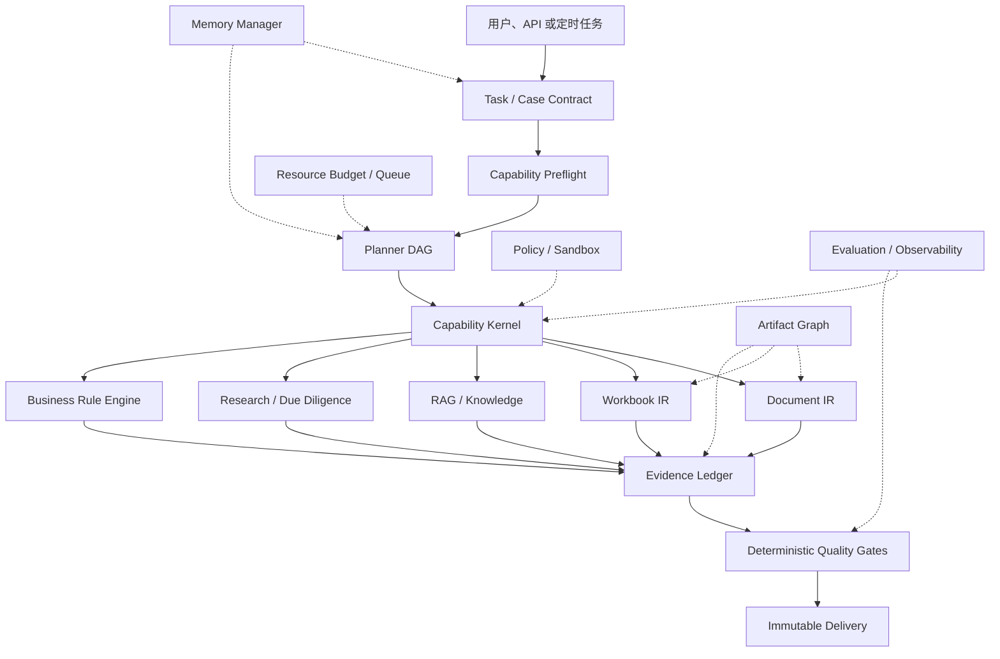

# Finwork Agent 能力底座研究记录

> 文档性质：架构研究记录、现状审计、问题分解和设计决策上下文  
> 状态：Research Record / **不是实施 Spec，也不构成实施授权**  
> 记录日期：2026-08-09  
> 主要输入：`docs/spec/design-xlsx-capabilities.md`、当前代码与测试、既有 Run/交付/RAG/记忆设计  
> 对应总实施文档：[`docs/spec/spec-agent-capability-foundation.md`](spec/spec-agent-capability-foundation.md)

## 1. 为什么先写这份记录

Finwork 目前已经不是“给模型接几个工具”的早期项目。仓库里已有 Run 合同、交付质量门、权限检查、知识库、记忆、Excel 工具、文件预览和一批财务 Skill；但这些能力仍主要以独立模块和局部约定存在。

本次讨论的目标，是回答一个更底层的问题：

> 怎样把 Finwork 建成一个长期使用后更可靠、更懂用户、更容易验证、不会因数据增长而越来越卡的财务 Agent，而不是不断在 UI、Prompt 和单点工具上补洞？

这份文档保存：

- 当前项目已经具备的真实能力；
- 能力缺口背后的共同根因；
- 讨论中形成的原则、术语和目标架构；
- 记忆、RAG、文档、Excel、复杂业务、联网调研、安全、文件和性能的细节；
- 哪些是代码事实，哪些是架构判断，哪些仍需实施时验证。

它故意不写成可以直接派发的逐文件任务。真正用于一次性实施的合同、模块边界、迁移顺序、测试与验收门槛，统一写在配套总 Spec 中。

## 2. 核心结论

当前 Finwork 的优势是：已经拥有一组质量较好的点状工具和部分可靠性合同。

当前 Finwork 的根本缺口是：还没有一个统一的“能力操作系统”来组织这些工具。

缺失的不是更多 Prompt，而是下面这条完整链路：

```text
Task / Case Contract
  → Capability Preflight
  → Planner DAG
  → Capability Kernel
  → Document / Workbook / RAG / Research / Business Engines
  → Evidence Ledger
  → Deterministic Quality Gates
  → Immutable Delivery
```

记忆、Artifact Graph、权限、安全、资源预算、审计和评测不是链路末尾的附加功能，而是贯穿每一步的横切能力。

如果这层底座正确，后续增加工资测算、税务申报、合并抵消、尽职调查、合同审阅、凭证生成等业务能力，本质上只是：

1. 注册新的能力；
2. 声明输入、输出、权限和证据；
3. 增加领域规则包；
4. 增加确定性验证与评测样本。

如果这层底座缺失，每增加一个场景都会继续复制 Prompt、工具判断、临时文件、错误处理、重试、记忆和交付逻辑。

## 3. 审计边界与证据口径

本记录使用三种标记：

- **代码事实**：当前仓库中可以直接观察到的实现；
- **架构判断**：根据多个模块的共同问题得出的结论；
- **目标设计**：建议统一实现的底层模型，不表示当前已经存在。

重点检查范围：

- Agent Runtime、路由、工具注册、Run 合同和 Completion Gate；
- role memory、memory.md、profile、上下文压缩和会话状态；
- 知识库 ingestion、chunk、embedding、检索与引用；
- Excel 工具、校验器、交付物状态；
- 文件存储、清理、去重和生命周期；
- 权限、路径、安全和联网能力；
- worker、同步任务、索引增长和长期性能。

本次不把 UI 是否漂亮作为 Agent 能力是否成立的证据，也不把模型回复中的“已完成”当作业务完成证据。

## 4. 当前项目已经有的可靠基础

### 4.1 Run 与完成语义

**代码事实**：项目已有显式 Run 合同、终止原因、CompletionEvidence、质量门和 settled 语义；这比只依赖模型消息可靠得多。

应该保留的关键原则：

- `run_settled.outcome` 保持 `completed | aborted | error`；
- 等待用户、等待依赖、暂停都不是终态，不提前 settled；
- 模型文字不是完成证据；
- validator 产出与输入/输出 hash 绑定的证据；
- delivered 文件必须经过正式质量门。

### 4.2 工具权限和路径边界

**代码事实**：`authorize.ts`、工具适配层、路径策略、Pi 扩展和自定义 built-in 已经形成较好的权限基础。

这意味着新架构不需要推倒重来，而应把现有授权提升为统一的 Policy Decision，并扩展到数据分类、网络出口、Secret、DLP 和危险文档内容。

### 4.3 知识检索

**代码事实**：当前 RAG 已支持关键词与向量混合检索，文档 ingestion 也覆盖了常见格式。

这是可用的起点，但还不是可审计的财务知识系统，因为结构定位、引用闭环、版本、有效期、实体/期间过滤和性能模型仍不完整。

### 4.4 Excel 能力

**代码事实**：`docs/spec/design-xlsx-capabilities.md` 中部分早期缺口已经被后续实现覆盖，包括工作簿修改、建表、勾稽检查、数据问题检测、带标签表格合并等。

因此，旧文档中的 G1-G4 不能再原样作为当前差距列表。真正缺失的已上移到：Workbook IR、依赖图、财务语义维度、规则包、可逆 Patch Plan、真实重算和不可绕过的验证证据。

## 5. 当前架构为什么会不断出现局部补丁

### 5.1 能力发现不是一等公民

当前工具由多个注册表、Skill 文本、运行时白名单和关键词路由共同决定。模型能否完成任务，往往取决于它是否“碰巧知道”某个工具和调用方式。

后果：

- 工具存在不等于能力可用；
- 缺少依赖时，Agent 会重复探测或改用 Bash/Python 猜测；
- 新增工具必须同时修改多处路由和提示；
- 无法在任务开始前回答“这台机器能否可靠完成此任务”。

### 5.2 Task Contract 太窄

现有合同已经覆盖部分文本、表格、合并报表和少量断言，但无法完整表达真实财务任务中的：

- 主体、期间、币种、单位、会计准则和司法辖区；
- 输入版本和来源；
- 业务不变量；
- 必须引用的证据；
- 人工决策点；
- 禁止猜测和禁止降级条件；
- 多交付物之间的一致性关系。

结果是关键语义仍留在自然语言上下文里，运行器和验证器无法消费。

### 5.3 证据分散

工具输出、RAG 引用、validator 结果、文件 hash、运行事件和最终回复分别存在不同位置。系统能证明“某工具运行过”，但难以证明“这个结论由哪个版本的哪个文件中的哪一处内容，经哪次转换和哪条规则产生”。

### 5.4 状态被重复表达

会话、Run、文件、记忆、知识库和交付物都有自己的局部状态。缺少统一实体和引用关系后，会出现：

- 文件被移动后引用失效；
- 会话清理不知道某文件是否仍被证据引用；
- 记忆更新不知道旧值是过期、冲突还是被替代；
- 断点恢复只恢复聊天，不恢复完整业务案例。

## 6. 不允许的“兜底”

这里的“不兜底”不是遇到错误就退出，而是拒绝用不可验证的路径伪装能力。

统一原则：

1. 缺失能力必须产生明确的 `capability_missing`，不能静默换成 Bash、模型猜测或低质量解析。
2. Bash/Python 只能作为受控计算能力，不能成为业务正确性的合同。
3. 模型说“完成”不能推动 Run 完成。
4. 没有不可变 locator 的 RAG 片段不能成为正式引用。
5. 记忆不能通过无限追加原始对话实现。
6. 文件清理不能删除仍被 Run、Claim、Case、Memory 或 Delivery 引用的 Artifact。
7. 网页和外部文档内容一律是 tainted evidence，不是系统指令。
8. 解析、重算或渲染引擎缺失时，不能把 warning 当作正式交付通过。
9. 未验证的修复不能进入长期记忆或规则库。
10. 性能压力不能通过截断审计证据或跳过验证解决。

## 7. 目标能力操作系统



### 7.1 CapabilityDefinition

每个能力都需要显式描述：

```text
id / version
inputSchema / outputSchema
preconditions
sideEffects
requiredPermissions
evidenceProduced
resourceEstimate
validator
failureSemantics
```

例子不是“有一个 xlsx tool”，而是：

- `workbook.inspect_structure@2`；
- `workbook.patch_lossless@2`；
- `finance.validate_balance_sheet@1`；
- `research.snapshot_web_source@1`；
- `document.extract_table_with_locator@1`。

### 7.2 Task / Case Contract

统一合同至少表达：

```text
goal
entity / counterparties
period / effectiveDate
currency / unit
accountingStandard / jurisdiction
inputs + immutable versions
requiredCapabilities
invariants / assertions
expectedOutputs
citation / evidence requirements
humanDecisionPoints
noGuess / noDegrade conditions
resourceBudget
retention / sensitivity
```

### 7.3 Planner DAG

复杂任务不应只存在为一串聊天 turn。Planner 应产出有依赖关系的步骤图：

- 每步引用能力 ID 和版本；
- 输入/输出是 Artifact 或结构化 Value；
- 步骤可重试、可缓存、可恢复；
- 人工确认是显式节点；
- 失败传播规则可计算；
- 并发必须受资源预算和数据依赖约束。

## 8. Evidence Ledger：可信财务 Agent 的中心

每条正式结论都应该能追溯：

```text
Claim
  → Source artifact + version + hash
  → Exact locator
  → Extraction result
  → Transform / tool version
  → Business assertion
  → Output artifact + hash
```

Ledger 不是日志替代品。日志回答“发生过什么”，Ledger 回答“为什么可以相信这个结论”。

Evidence 至少分为：

- 来源证据：原始文件、网页快照、用户确认；
- 提取证据：页、段、表、单元格、公式、OCR 区域；
- 转换证据：工具、版本、参数、输入输出 hash；
- 业务证据：规则 ID、规则版本、断言结果和容差；
- 交付证据：最终文件 hash、验证器结果、签名和 delivered 路径。

不确定性必须是一等字段，不能只写在自然语言里。

## 9. Artifact Graph 与文件生命周期

### 9.1 为什么不能继续按目录清理

当前临时清理、保留、去重和交付逻辑分散，无法可靠判断文件是否仍被使用。单纯按 mtime 删除会破坏：

- 历史任务证据；
- 记忆来源；
- 知识库索引；
- 派生文件链；
- 审计和重新验证。

### 9.2 目标模型

- 内容按 hash 寻址，逻辑文件名只是引用；
- 原件、解析结果、预览、向量、工作副本、候选交付和正式交付均是 Artifact；
- 维护 `derivedFrom`、`supersedes`、`usedBy`、`supportsClaim` 等边；
- 生命周期：`staging → candidate → delivered → archived → tombstoned`；
- 支持 pin、legal hold、retention policy 和引用计数；
- 清理使用 mark-and-sweep，默认 dry-run，先 tombstone 后物理回收；
- 正式交付和被 Evidence 引用的 Artifact 不允许直接物理删除。

## 10. 记忆：保存、使用、冲突和清理

### 10.1 当前问题

当前记忆分布在 role memory、`memory.md`、profile、compaction facts 和会话中：

- role memory 主要按时间取最新记录；
- `memory.md` 是有限大小的文本块；
- profile 使用浅层合并；
- 系统提示可能注入较多完整记忆；
- compaction facts 偏金额、期间和格式习惯；
- in-flight session 主要是单进程状态。

**架构判断**：这些机制可以辅助单轮体验，但不能承担长期财务记忆。

### 10.2 五类记忆

1. **Working Memory**：当前 Run/Case 的短期状态、未决项和中间值；
2. **Episodic Memory**：某次已验证任务发生了什么；
3. **Semantic Memory**：主体、账户、供应商、口径、偏好等长期事实；
4. **Procedural Memory**：被评测验证过的流程、规则和修复策略；
5. **Feedback Memory**：用户对输出的纠正、接受和拒绝。

### 10.3 MemoryRecord

每条长期记忆至少包含：

```text
scope / entity / effectivePeriod
source / evidenceRefs
confidence / sensitivity
createdAt / lastUsedAt / expiresAt
supersedes / conflictsWith
owner / approvalStatus
```

### 10.4 写入流程

```text
候选提取
  → 证据绑定
  → 敏感性分类
  → 冲突检测
  → 自动或人工批准
  → 版本化写入
```

原始对话、未验证工具输出和模型推测不能直接成为长期事实。

### 10.5 使用流程

检索必须先过滤：任务、主体、期间、权限、敏感性和有效期，再按相关度排序。只注入当前步骤需要的字段和证据摘要，不把整个记忆库塞进 Prompt。

### 10.6 清理流程

- Working Memory 按 Run/Case TTL 清理；
- 被新版本替代的事实保留历史，但默认不召回；
- 冲突事实并存并等待裁决，不能覆盖；
- 长期未使用且未批准的候选可衰减；
- 被正式 Evidence、Case 或交付引用的记忆只能归档，不能物理删除；
- 用户可查看、纠正、导出和请求删除，删除仍受审计/法定保留约束。

## 11. RAG：准确、快速、可引用

### 11.1 当前问题

- chunk 偏通用字符窗口，不理解文档结构；
- Excel 表格语义和 PDF 页面结构不充分；
- 向量检索可能全表扫描；
- embedding worker 生命周期短，重复启动；
- ingestion 或 vector 失败存在静默降级风险；
- topK 和文本行号不足以支撑正式引用；
- 查询缺少主体、期间、权限、文档类型和有效期过滤。

### 11.2 CitationRecord

```text
artifactId / version / hash
documentType
page / section / paragraph
table / row / column
sheet / range
charStart / charEnd
quotedText
effectiveDate
retrievalScore / rerankScore
```

### 11.3 检索流水线

```text
Query classification
  → ACL / sensitivity / entity / period / document filters
  → lexical + vector candidate retrieval
  → parent-child structural expansion
  → rerank
  → citation validation
  → claim binding
```

### 11.4 性能设计

- 持久 embedding worker/worker pool；
- ANN 索引而不是全表余弦扫描；
- 按 Artifact hash 增量索引；
- 结构化 chunk：标题-段落、表头-行、工作表-区域、脚注-引用；
- query、embedding、candidate 和 rerank 分层缓存；
- 缓存 key 包含模型、chunker、parser 和权限版本；
- 失败必须可见，正式任务不能无提示退回低质量结果。

## 12. Document IR：基础文档能力的共同底座

Word、PDF、PPT 和 Excel 不应该各自实现一套“读文字、改内容、找引用”。统一 Document IR 至少表示：

- block、paragraph、heading；
- table、row、cell、merge；
- style、numbering、list；
- image、caption、footnote；
- comment、revision、bookmark、link；
- page/layout anchor；
- raw locator 与 semantic locator 的双向映射。

文档操作必须是可逆的 Operation：

- 带 precondition；
- 产出结构 diff 和视觉 diff；
- 可重放和回滚；
- 不支持的结构明确阻断或只读保留；
- 不能通过“转纯文本再生成”静默丢失格式、批注、公式、宏或链接。

格式适配器负责 DOCX/PDF/PPTX/XLSX 与 IR 的转换，领域能力只消费 IR。

## 13. Workbook IR 与财务规则引擎

### 13.1 Workbook IR

Workbook IR 需要同时维护三层图：

1. **结构图**：workbook、sheet、table、range、merged cell、named range；
2. **依赖图**：formula、cross-sheet reference、external link、calculation chain；
3. **财务语义图**：entity、period、account、currency、unit、scenario、statement line。

另有一层 preservation 信息，用于保持样式、条件格式、数据验证、图表、打印设置、宏和外部链接。

### 13.2 Patch Plan

所有修改先形成 Patch Plan：

- 定位目标；
- 检查 precondition；
- 列出 insert/update/delete/move/formula/style 操作；
- 计算影响范围；
- 生成可读 diff；
- 执行到工作副本；
- 真实重算、结构检查、业务断言和视觉检查；
- 失败时回滚，不污染原件。

### 13.3 财务规则包

规则必须版本化并带来源、适用地区和生效日期，包括：

- 三大报表及附注勾稽；
- 科目映射和重分类；
- 多期间同比/环比；
- 合并范围、内部交易抵消、未实现损益、少数股东权益；
- 外币折算；
- 税务、薪酬、凭证和发票规则；
- 业务自定义口径和容差。

规则结果必须进入 Evidence Ledger，而不是只返回一段文本。

## 14. 复杂业务：从聊天升级为 Case Graph

复杂财务业务需要一个长期 Case，而不是把状态全部放在会话消息里。

Case Graph 连接：

- 企业、人员、关联方；
- 期间、币种、准则和辖区；
- 合同、订单、发票、凭证、申报义务；
- 假设、风险、审批、待确认问题；
- 输入、派生数据、交付物和 Evidence。

Case 支持：

- checkpoint/resume；
- 多 Run 协作；
- 人工决策节点；
- 版本和变更原因；
- 截止日期和任务依赖；
- 从历史 Case 召回已验证事实，但不继承过期口径。

## 15. 联网搜索与尽职调查

当前项目即使仍保留 WebSearch/WebFetch 名称，也不能据此认定具备可交付的联网研究能力。真正的 Research Protocol 需要：

1. 查询计划和覆盖范围；
2. 首选监管、公司公告、法院、交易所等一手来源；
3. URL、抓取时间、内容 hash、司法辖区和有效日期快照；
4. 来源可信度和冲突关系；
5. 每条 Claim 的精确引用；
6. 明确列出未覆盖和无法确认的事项。

尽职调查在此基础上增加：

- 公司与受益所有人；
- 关联方和关键人员；
- 诉讼、处罚、失信和监管记录；
- 财务状况和异常指标；
- 新闻与舆情，但必须与事实来源区分；
- 名称消歧、同名主体和跨语言映射；
- 时间线与冲突证据图。

网页内容必须经过 taint/prompt-injection 隔离；任何页面要求 Agent 泄露数据、修改系统规则或执行指令都应被当作恶意内容。

## 16. 安全底座

### 16.1 数据和访问

- 数据分类：公开、内部、机密、受监管；
- tenant/user/case/artifact 级 ACL；
- 每次检索、工具调用和导出都重新授权；
- 证据与审计记录保留访问决策。

### 16.2 Secret 与网络

- Secret Broker 提供短期、最小范围凭证；
- Secret 不进入 Prompt、日志、工具输出和 Memory；
- 网络出口默认拒绝，按 capability/provider/domain 放行；
- 外部上传需要 DLP 和用户确认。

### 16.3 文件安全

- MIME、扩展名和 magic bytes 交叉验证；
- 压缩炸弹、路径穿越、恶意宏、外部链接、公式注入检查；
- 可执行内容隔离；
- 不可信文件先 quarantine，再解析；
- 文档中的 Prompt Injection 标记为 tainted span。

### 16.4 审计

必须能回答谁在何时基于什么权限读取了什么、执行了什么、产生了什么、向哪里发送了什么。

## 17. 文件管理和清理

用户需要看到的是逻辑文件和业务状态，而不是运行时目录。

能力包括：

- 上传、生成、候选、正式交付、归档、删除请求；
- 多文件批次和派生关系；
- 去重但保留逻辑引用；
- 按 Case/会话/主体/期间查找；
- 预览缓存独立回收；
- 用户可恢复的回收站；
- 清理预览、dry-run 和影响说明；
- 自动规则不触碰 legal hold、delivered 或 Evidence 引用对象。

## 18. 性能：不能越用越卡

当前容易随使用增长恶化的路径包括：

- 全量向量扫描；
- 每次任务重复启动解析/embedding 进程；
- 同步重型文档解析；
- Prompt 注入完整记忆；
- 长会话和工具输出不断增长；
- 预览、索引和临时文件缺少统一预算；
- 同一文件重复解析、重算和渲染。

目标机制：

- 持久 worker pool、队列和 backpressure；
- CPU、内存、磁盘、网络、token、并发和时长预算；
- 按 hash 的增量解析、索引、预览、验证和缓存；
- 缓存 key 包含输入、工具、规则和权限版本；
- 大输出对象化存储，Prompt 只保留摘要和引用；
- 会话、工具输出、索引、缓存、预览、Memory 都有独立 quota；
- 可观测 p50/p95、队列等待、缓存命中、索引增长、GC 回收和内存高水位。

“越用越好用”只能来自：

- 已验证 Memory；
- 命中的结构化缓存；
- 扩充且评测通过的规则包；
- 对失败样本形成回归集；
- 更准确的主体/期间/文档映射。

不能来自无限保留聊天、未验证修复和越来越大的 Prompt。

## 19. 评测与持续改进

评测单位应是 Case/Task Contract，不是聊天是否自然。

至少分层：

- 能力合同测试；
- 文档往返与保真测试；
- 财务规则与不变量测试；
- RAG 引用准确率、召回率和越权测试；
- Memory 冲突、过期、删除和污染测试；
- 安全红队与 prompt injection 测试；
- 资源、长期运行、恢复和性能测试；
- 真实黄金文件的重算、渲染、业务断言和 hash 证据。

工具调用次数、回复关键词和模型自报完成只能作为诊断信号。

## 20. 实施优先关系

虽然目标可以作为一次完整工程实施，但底层依赖仍然有顺序：

```text
共享合同与 Capability Registry
  → Task/Case Contract + Preflight + Evidence Ledger
  → Artifact Graph + Memory + Knowledge References
  → Document IR + Workbook IR + Rule Engine
  → Research / Due Diligence + Security
  → Resource Governance + Evaluation + Atomic Cutover
```

这里的顺序不是建议只做一半上线。含义是：一个总实施计划内部必须先冻结上游合同，再并行实现下游模块，最终通过统一集成门后一次切换；不能让新旧语义长期并存，也不能用 legacy 路径作为运行时兜底。

## 21. 已形成的设计决定

1. 以 Capability Kernel 为能力入口，而不是继续扩散工具路由。
2. 以 Task/Case Contract 表达业务完成条件。
3. 以 Evidence Ledger 作为可信结论中心。
4. 以 Artifact Graph 管理文件、派生物、索引、预览和交付生命周期。
5. 记忆必须证据化、版本化、可冲突、可过期、可清理。
6. RAG 必须结构化定位、权限过滤和 Claim 绑定。
7. 文档与 Excel 分别建立 IR，领域能力不直接绑格式细节。
8. 财务规则包必须版本化、有生效范围、有来源和验证证据。
9. 复杂业务以 Case Graph 长期承载。
10. 联网调研必须快照、引用、冲突分析和 coverage 声明。
11. 安全、文件生命周期和资源预算作为底层合同，不在末尾补。
12. 实施采用一个总 Spec、内部有序并行、最终统一切换；不保留静默降级。

## 22. 仍需在实施中验证的问题

- 当前 SQLite 版本与数据量下，Artifact/Evidence/Memory 图模型的索引方案；
- Document IR 是否自研最小核心或适配成熟解析器；
- Excel 真实计算引擎在三平台的分发、签名和资源成本；
- Web provider、企业数据源和各地区监管源的授权方式；
- 受监管数据的默认保留期和删除策略；
- 大型工作簿/扫描 PDF 的资源基线；
- 自动批准 Memory 的风险等级边界；
- 现有 conversation/file/knowledge 数据迁移的规模与异常样本。

这些问题不应通过兜底路径绕过。总 Spec 要求实施前先用真实数据 fixture 和 migration dry-run 给出答案。

## 23. 与现有文档的关系

- `docs/spec/design-xlsx-capabilities.md`：保留为 Excel 能力演进输入；其早期缺口需按当前代码重估。
- `docs/harness-agent-design-discussion.md`：保留 Runtime/Harness 的历史讨论，本记录将其扩大到完整能力底座。
- `docs/spec/ROADMAP-complex-task-reliability.md`：保留已实施的 Run/交付合同和兼容性约束。
- `docs/spec/spec-agent-architecture.md`：作为现有 Agent 架构背景，不替代本记录的统一 Capability Kernel 结论。
- `docs/spec/spec-memory-module.md`、`docs/spec/spec-semantic-search.md`：作为局部设计输入，实施时统一迁移到 Memory v2 和 Retrieval v2 合同。

## 24. 下一份文档如何使用

[`docs/spec/spec-agent-capability-foundation.md`](spec/spec-agent-capability-foundation.md) 是本记录对应的唯一总实施文档。它将：

- 冻结共享类型和模块边界；
- 给出一次性完整实施所需的工作包和依赖图；
- 列出数据迁移、兼容、切换和删除 legacy 的方式；
- 明确每个能力的验收、性能、安全和无兜底门槛；
- 给出全新上下文的实施者可以执行的文件范围和验证命令。

即使该 Spec 已经完整，仍需用户明确批准“实施”后才能修改生产代码。

## 25. 实施后的记录补充（2026-08-12）

用户已授权实施，统一能力底座已按总 Spec 的 WP0–WP13 落到同一个工程计划中。当前代码结论不再是“是否应该建设”，而是：共享合同、Capability Registry、Task/Case、Artifact/Evidence、Memory v2、Retrieval v2、Document/Workbook IR、财务规则、研究、安全、文件生命周期、资源治理、评测与原子切换机制均已具备本地实现和确定性测试。

本记录中的底层判断保持有效，但第 22 节的问题现在分成两类：

- 已在代码和本地协议测试中闭环：图模型表结构与索引、最小 Document/Workbook IR、受控研究 Provider 合同、Memory 生命周期、引用验证、文件 GC、资源预算、可恢复任务和结构化失败；
- 必须在真实环境关闭：Office/LibreOffice 三平台分发与签名、真实联网 Provider 授权、真实大文件容量基线、真实 24 小时 packaged soak、真实业务数据迁移异常样本和原子 cutover/rollback 演练。

当前实现已经推进到数据库 v42，并补齐了记忆归档/冲突键、安全决策持久化、研究发布门和文件安全清单。全量确定性测试、Capability Foundation、安全矩阵、研究、文件生命周期、资源治理和迁移快照演练均通过；真实 OCR、真实模型、真实 Office、受控业务样本和联网授权仍按结构化 blocker 保留。加速资源压测只证明机制可恢复与预算收敛，不作为 24 小时发布证据。

生产目录不再依赖某次 Agent 调用或管理页读取顺便注册：Node 运行时启动会同步完整生产工具目录，当前实测为 53 项可用能力；被新版本移除的财务能力只会转为 deprecated/unavailable 审计状态，不会静默消失或继续可执行。生产 API 与治理页已在构建后的服务上核对一致，浏览器控制台无 warning/error。

这里仍坚持原始边界：本地 fake、加速时间和协议测试不能替代真实 Provider、真实 Office、真实网络、真实文件及人工检查交付物。完整实施与发布证据以 [`docs/spec/audit-agent-capability-foundation.md`](spec/audit-agent-capability-foundation.md) 为准。
