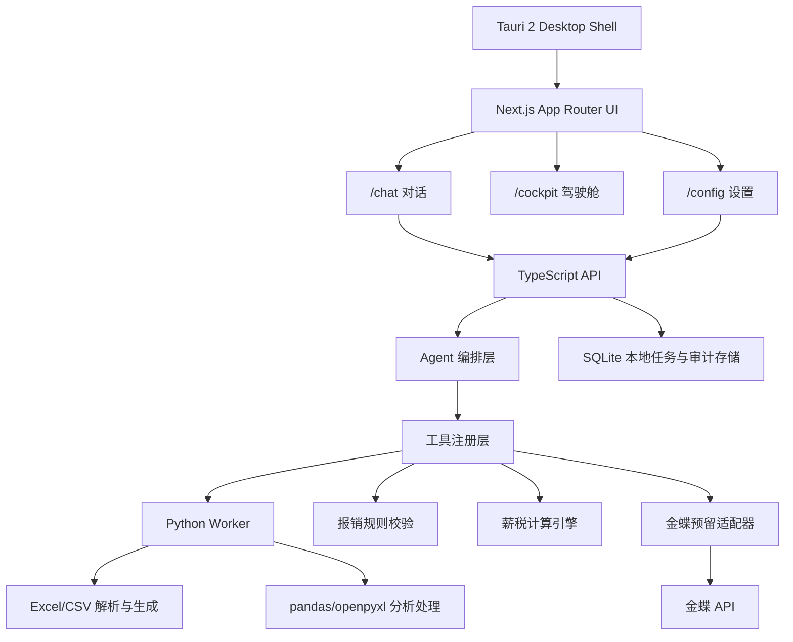

# 财务 Agent 第一版架构设计

第一版只服务财务人员，不做员工入口、多角色审批和金蝶正式写入。系统目标是把财务人员现在的人工核验、录入、计算和制表工作变成可复核、可追溯的 Agent 工作台。

当前前端按三个顶层区域组织：

- `/cockpit`：驾驶舱首页，展示总览指标和待处理事项，当前使用假数据占位。
- `/chat/new`、`/chat/recent`：Codex 风格主工作台，左侧是新对话和最近消息，中间是消息与 Agent 处理时间线，右侧是当前对话本地文件。`/chat` 默认跳转新对话。发送成功后自动保存用户消息，Agent 返回后后台保存回答，最近对话从 SQLite 读取真实记录。
- `/config`：设置入口，维护技能、模型和通用偏好。

## 总体架构



## 关键原则

- Agent 负责理解任务、拆步骤、调用工具和解释结果。
- 报销校验、薪税计算、报表生成必须落在确定性工具中。
- 财务人员在高风险节点确认，系统记录输入、配置版本、输出和确认动作。
- 金蝶第一版只预留接口，默认导出草稿，不直接写入正式凭证。
- 默认持久化使用 SQLite，方便后续同时支持 Windows 和 macOS 本地部署。

## 模块边界

| 模块 | 职责 |
| --- | --- |
| 驾驶舱 `/cockpit` | 财务总览首页，展示关键指标、待处理事项和 AI 洞察占位 |
| 对话 `/chat/*` | 主工作台。新对话和最近对话都通过 `/api/agent/query` 调用 Agent；消息区展示用户输入、Claude 回答、已处理时间线、文件引用和输出文件 |
| 设置 `/config` | 技能开关、模型 URL/API Key 和通用偏好 |
| Agent 编排层 | 使用 TypeScript 版 Claude Agent SDK，读取配置中心的 API URL/API Key 后调用 Agent |
| Python Worker | Excel、CSV、PDF、分析报表和复杂表格生成 |
| 规则引擎 | 日期、金额、重复发票、字段缺失等报销校验 |
| 报税/薪税引擎 | 根据税率版本和工资模板计算应纳税、个税、实发，作为报税准备数据 |
| SQLite 数据层 | 本地保存任务、审计日志、技能快照和后续配置数据 |
| 审计日志 | 记录文件、配置版本、工具调用和人工确认 |
| 金蝶适配器 | 后续接金蝶 API；第一版只生成导出草稿 |

## 本地数据库

第一版默认使用 SQLite，而不是 PostgreSQL。原因：

- Windows/macOS 本地部署成本更低，不需要安装和维护数据库服务。
- 单人财务工作台第一阶段并发压力很低，SQLite 足够支撑任务、审计和配置数据。
- 后续如果需要多人协作或服务端部署，可通过 repository 层再迁移到 PostgreSQL。

默认数据库文件位于系统应用数据目录：

```text
macOS: ~/Library/Application Support/finance-agent/finance-agent.db
Windows: %APPDATA%\finance-agent\finance-agent.db
Linux: ${XDG_DATA_HOME:-~/.local/share}/finance-agent/finance-agent.db
```

可通过 `FINANCE_AGENT_APP_DATA_DIR` 或 `FINANCE_AGENT_DB_PATH` 覆盖。该文件属于本地运行数据，不应写入安装目录或项目目录。

本地设置和可编辑技能也写入同一个应用数据目录：

```text
local-settings.json
skills/
```

仓库内 `skills/` 只作为初始种子资源，首次运行时复制到用户数据目录，后续编辑不会修改安装包内资源。

当前本地表包含：

- `audit_logs`：审计事件。
- `skill_snapshots`：后续技能快照迁移预留。
- `chat_conversations`：对话会话，`title` 保存首条用户问题全文，避免标签信息丢失。
- `chat_messages`：与 LLM 的逐条对话记录，包含用户消息和 Agent 回答。
- `chat_attachments`：上传文件、引用文件和 Agent 输出文件元数据，右侧文件栏按当前对话聚合展示。

## Agent 工具

```text
parse_reimbursement_table(file)
validate_reimbursement_batch(batch)
generate_reimbursement_sheet(batch)
calculate_payroll(input, taxConfigVersion)
analyze_finance_table(file, analysisType)
export_kingdee_draft(batch)
```

## Claude Agent SDK

第一版通过 `@anthropic-ai/claude-agent-sdk` 的 `query()` 接入 Claude Agent。配置项在配置中心维护：

- `API URL`：默认 `https://api.anthropic.com`
- `API Key`：本地保存，不返回浏览器明文
- `模型 ID`：可手动填写 Claude 模型，例如 `claude-sonnet-4-5`

配置文件：

```text
<app-data>/local-settings.json
```

如果未配置 API Key，系统会回退到本地 mock Agent，保证工作台仍可使用。

前端交互优先使用 SDK 的流式能力：

- `query()` 作为 async generator 输出 system、assistant、result 等消息，后端转成 SSE。
- `includePartialMessages` 打开后，文本增量即时推送到中间对话区；raw thinking 不进入 UI 和持久化。
- `system init` 和 assistant content 中的 tool use/tool result 被归一化为前端 `agent_event`，展示在“已处理”可展开时间线里。
- SDK MCP server 运行在应用同进程，`finance_worker` 负责财务工具、文件生成和 Python 兜底能力。
- MCP 工具通过 `allowedTools` 精确放行，避免把权限扩大到不必要的工具范围。
- 配置中心启用的本地 skills 会在每次调用前汇总进 system prompt，作为业务流程指令，而不是只停留在设置页。
- Excel 任务参考 `excel-demo` 的模式：本地 `excel-finance` skill 负责流程约束，`inspect_excel_workbook` 负责先探查 workbook，复杂生成/改造交给 `run_python + openpyxl`。
- `canUseTool` 会拦截 `AskUserQuestion`：SSE 通道默认拒绝并要求 Claude 用文本询问；WebSocket sidecar 可把问题推给前端并等待用户选择。
- `Write/Edit/MultiEdit` 被限制在本次会话输出目录，避免 Agent 误改项目代码或用户其他文件。

对话持久化同时保存应用会话和 Claude 会话的映射：

- 本地 `chat_conversations.id` 是前端和业务侧对话 ID。
- 首次调用前生成 Claude `session_id` UUID，写入 `chat_conversations.claude_session_id`，并通过 SDK `sessionId` 传给 Claude。
- 后续同一对话调用 SDK 时使用 `resume: claude_session_id`，并只发送最新用户消息，避免重复提交历史上下文。

### WebSocket sidecar

参考 Claude Agent SDK demo，项目新增可选长连接 sidecar：

```bash
npm run agent:ws
```

默认监听：

```text
ws://localhost:3761/agent
```

协议：

- 前端发送 `{ "type": "prompt", "text": "...", "sessionId": "可选" }`。
- 服务端返回 `connected/session/status/chunk/agent_event/question/done/error`。
- 当 Claude 调用 `AskUserQuestion` 时，服务端发送 `question`，前端再用 `{ "type": "answer", "id": "...", "label": "..." }` 回答。

现有 `/chat` 仍使用 Next API + SSE，因为它已经承载文件上传、SQLite 持久化和右侧文件栏。WebSocket sidecar 是桌面/Tauri 长连接方向的入口，后续可以逐步替换 SSE。

## 风险分级

| 等级 | 行为 | 处理方式 |
| --- | --- | --- |
| 低 | 字段识别、表格清洗、统计汇总 | Agent 可自动执行 |
| 中 | 报销异常判断、字段映射确认 | 展示依据，由财务确认 |
| 高 | 薪税最终结果、金蝶推送、历史数据覆盖 | 必须二次确认并审计 |

## Tauri 2 适配状态

仓库已包含 `src-tauri/`，用于 Windows 和 macOS 桌面壳：

- `npm run tauri:dev`：开发模式，Tauri 打开 `http://localhost:3000`，由 Next dev server 提供页面和 API。
- `npm run tauri:build`：生产打包入口，会先执行 Next standalone build 并准备 `src-tauri/resources/next-server`。
- 打包机必须安装 Rust toolchain，使 `cargo --version` 可用；macOS 还需要 Xcode Command Line Tools，Windows 需要 Microsoft C++ Build Tools / Windows SDK。

当前生产打包的关键约束：

- Next App Router API routes 依赖 Node 运行时、`node:sqlite`、文件系统和 Claude Agent SDK。
- Tauri 的 `frontendDist` 只能稳定加载静态前端资源，不能自动托管 Next API routes。
- 当前已把 Next standalone server、静态资源、样式、技能种子和 Python worker 准备为 Tauri resource。
- 生产版本还需要补齐 Windows/macOS Node runtime sidecar，或继续把 API routes 迁移到 Rust commands。

本轮已经完成的跨平台基础：

- 运行数据不再默认写入 `process.cwd()/data`。
- SQLite、Claude 设置、技能编辑和 Python demo 数据都支持应用数据目录和环境变量覆盖。
- Tauri 工程使用独立 bundle identifier `com.gyro.financeagent`，窗口尺寸按桌面工作台调整。
