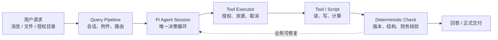
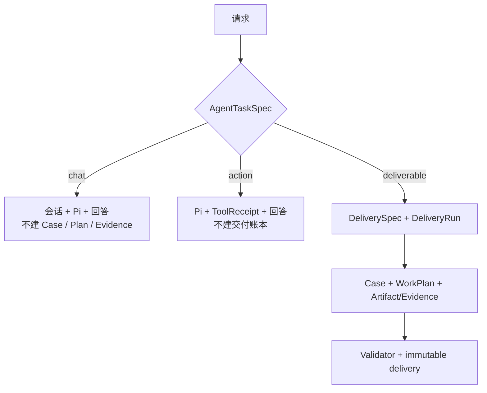
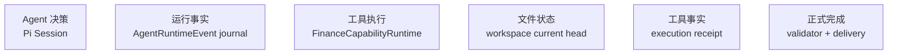
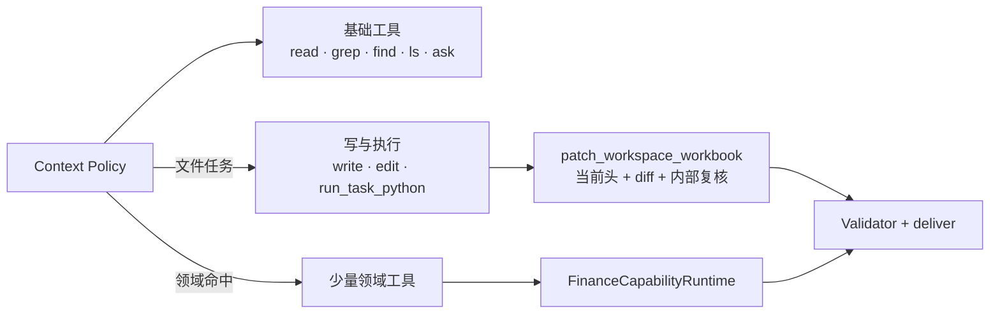
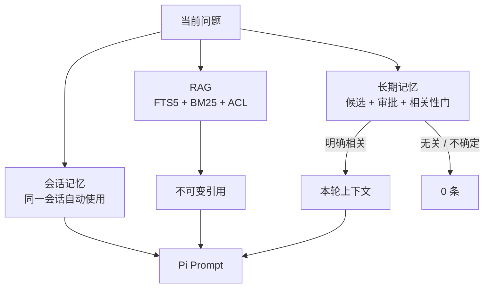
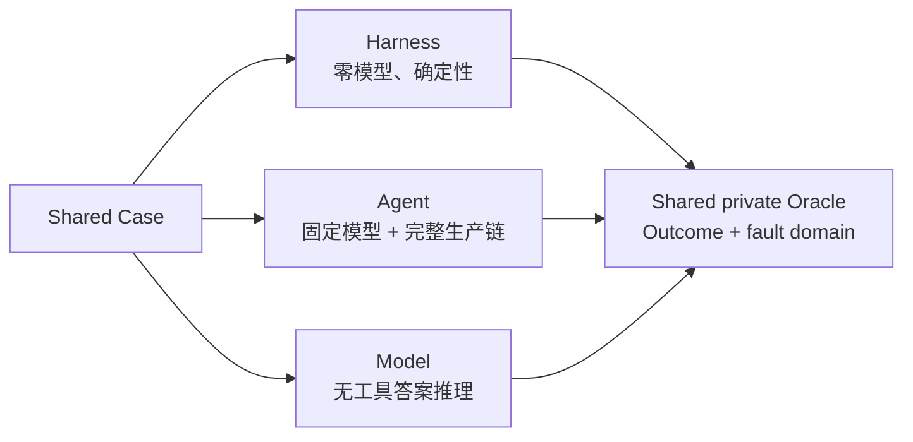
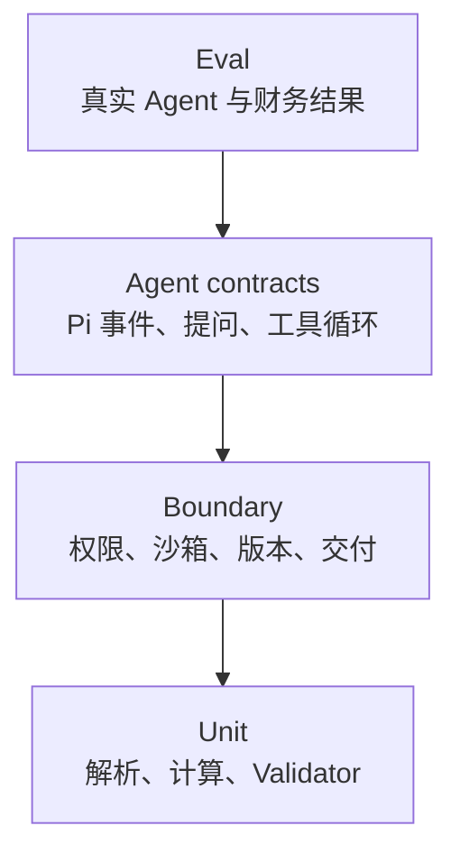
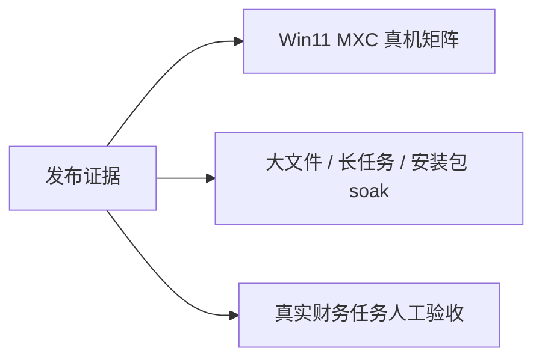
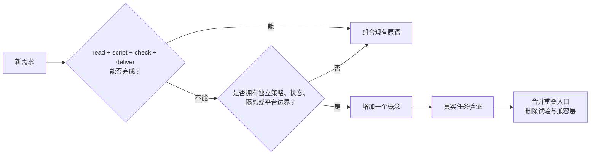

# Finwork Agent Kernel 架构图

> 当前实现，2026-08-20。Markdown 是文档权威，[HTML/SVG 总览](./agent-harness-architecture.html) 用于快速查看。

## 1. 一条生产路径

**Pi 决定下一步；Harness 只守住真实副作用和完成条件。**
已删除 rollout / shadow / gateway 透传层和第二份工具执行账本。

## 2. 任务按结果升级

| 类型 | 结束条件 | 持久化重量 |
| --- | --- | --- |
| `chat` | Pi 正常回答 | 会话与运行事件 |
| `action` | 工具结果或正常回答 | 再加 ToolReceipt |
| `deliverable` | 必需产物通过阻断校验 | 再加 Case / Plan / Evidence / Artifact |

附件、“请分析”或调用工具，本身不再等于“必须建立长任务 DAG”。

## 3. 唯一权威

| 问题 | 唯一权威 | 不再使用 |
| --- | --- | --- |
| 下一步做什么 | Pi Session | Harness Planner 代替 Agent 决策 |
| 运行中发生了什么 | Runtime Event journal | envelope / legacy 双写语义 |
| 工具是否执行 | Tool Executor receipt | 多层 ledger 重复记录 |
| 应从哪个文件继续 | current head + parent version | 模型自己维护 v2/v3/v10 |
| 交付是否合格 | Validator + immutable delivery | 模型自报完成 |

### 工具面也只有一个入口

- 普通聊天没有写工具；文件任务才开放 `write/edit`，`bash` 不属于默认模型工具面。
- 生产领域目录从 59 个收至 47 个，每回合只暴露上下文命中的子集。
- 知识检索与精读合并为 `search_knowledge`；用 `query` 检索，用 `fileName + 行号` 精读。
- `begin/review_workspace_change` 已删除，版本计划、父子链、diff 和复核由 `patch_workspace_workbook` 内置。
- 凭证勾稽、科目映射、分录构造和汇总是 `process_voucher_batch` 的内部步骤。
- 固定工作簿检查小工具已下沉：任务特有计算用脚本，正式正确性由交付 Validator 判断。
- 领域工具不再先包装成 Claude MCP server；`FinanceToolDefinition[] → Pi adapter → FinanceCapabilityRuntime` 是唯一注册与执行链。
- 高风险确认清单、角色边界和请求工具集各有一个权威；Pi builtin 的路径/沙箱限制留在 builtin executor，不再被领域 hook 重复拦截。

## 4. 文件与脚本闭环

- 同一 asset 只有一个当前候选头；修复必须从它继续，旧基线报 `stale_base_version`。
- Agent 可按任务写、跑、修改脚本；Harness 只管路径、权限、资源和输出校验。
- Excel 用格子/公式/样式语义 Diff；文本用行 Diff；不可解析二进制至少保留 hash 和大小。
- 沙箱不可用时 fail-closed，不退回无约束 Python。

## 5. 上下文、RAG 与记忆

RAG 不使用 Embedding 模型。长期记忆不根据历史任务揣测用户下一步意图；不相关比少召回更糟。

旧 `memory.md` 文件 API、逐回合迁移、迁移日志和 `role_memory` 表已经删除。当前 Prompt 只注入已批准、作用域匹配且通过相关性门的 governed memory。角色详情页手工添加属于用户在设置页的明确批准；对话中的记忆工具仍只能提交候选。

## 6. Eval 只有三个视角

- 删除 `mixed`；每次运行必须明确在测 Harness、Agent 还是 Model。
- Outcome 是共享评分结果，不是第四个 executor。
- 30-case General Agent Pilot 与历史财务工作簿复用同一 Agent 生产入口和私有 Oracle。
- 性能计数用于定位，不会在任务正确时单独判失败。

## 7. 测试金字塔

- `test:core`：27 个生产合同，每项只跑一次；新增的是角色设置页与 governed memory 的真实 API 边界，不是源码快照。
- `test:agent`：Pi 主循环、AskUserQuestion、沙箱、压缩与取消。
- `test:eval-kernel`：生产 executor、三视角边界、30-case Case/Oracle 和付费门禁。

已删除巨型顺序 `all.test.ts`、旧 Golden/AS0 executable suite、已删抽象的快照测试，以及只 `includes()` 检查 UI 源码文字的伪行为测试。发布能力回归保留 General Agent 30-case、Finance Professional 30-case 和历史真实财务工作簿，三者不互相冒充。

## 8. 代码地图

| 责任 | 位置 |
| --- | --- |
| 请求分类与运行准备 | `lib/agent/task-spec.ts`, `lib/agent/agent-run-service.ts` |
| Pi 主/子 Agent | `lib/agent/pi/`, `lib/agent/production-turn.ts` |
| 轻量交付规格 | `lib/agent/run-contract.ts` |
| 工具执行与确认 | `lib/agent/tools/`, `lib/agent/hooks/`, `lib/agent/mcp-tools/` |
| 复杂交付运行 | `lib/task/production-runtime.ts` |
| 文件、重算、校验 | `lib/file-workspace/`, `lib/runtime/artifact-runtime.ts`, `lib/deliverable/` |
| RAG / Memory | `lib/retrieval/`, `lib/memory-v2/` |
| 安全 / 资源 / 事件 | `lib/security/`, `lib/resource/`, `lib/agent/runtime-events.ts` |
| Eval | `lib/evaluation/benchmarks/`, `scripts/benchmark-*.mts` |

## 9. 还值得做的三件事

1. 继续拆小 `production-runtime.ts`，但只按“独立策略/故障边界”拆，不再增加透传层。
2. 计划 UI 暂不上线；后端 WorkPlan 和 Runtime Event 保留为可直接投影的事实。
3. 用真实 Win11、大工作簿和安装包证明平台边界；不用更多抽象替代这些证据。

## 10. 新设计的减法门

最简单的准则：**删掉这一层后，如果安全、正确、恢复和用户结果都不变，就不应保留它。**
