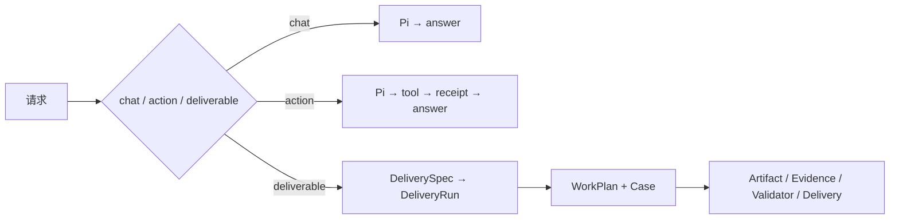

# WorkPlan 与交付治理（已收口）

> 本文档保留旧链接。Capability Foundation 的 rollout / shadow / gateway 已从生产路径删除。当前架构以 [Agent Kernel 架构图](./agent-harness-architecture.md) 为准。

## 当前规则

- WorkPlan 只属于需要持久恢复的正式交付，不是所有聊天的必经步骤。
- Pi Session 是唯一 Agent 决策循环；WorkPlan 是可展示的业务进度，不是第二个 Planner。
- `FinanceCapabilityRuntime` 是工具执行入口；权限、用户确认、资源和安全拦截保留，纯透传 Gateway 不保留。
- 正式完成仍由 Validator + immutable Delivery 决定，不接受模型自报完成。
- UI 尚未展示 WorkPlan，但后端状态和 Runtime Event 可直接投影，无需再设计一套状态。
