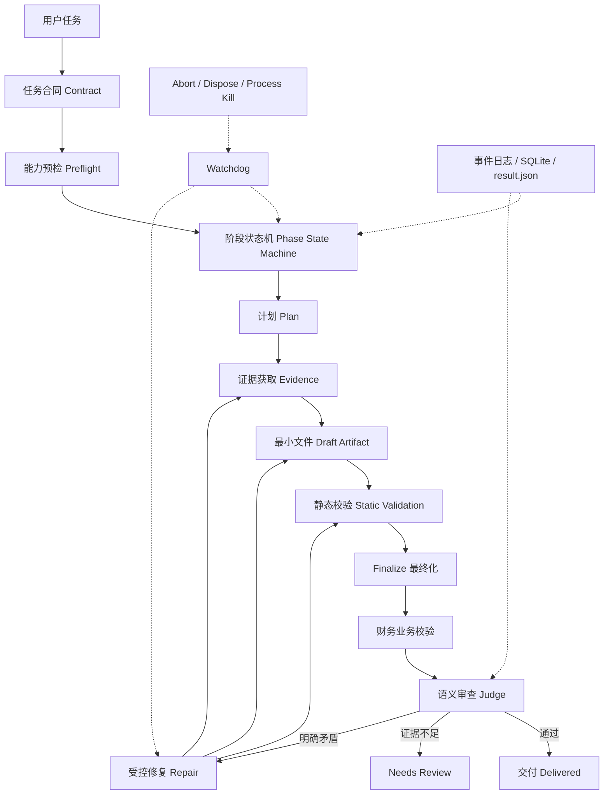
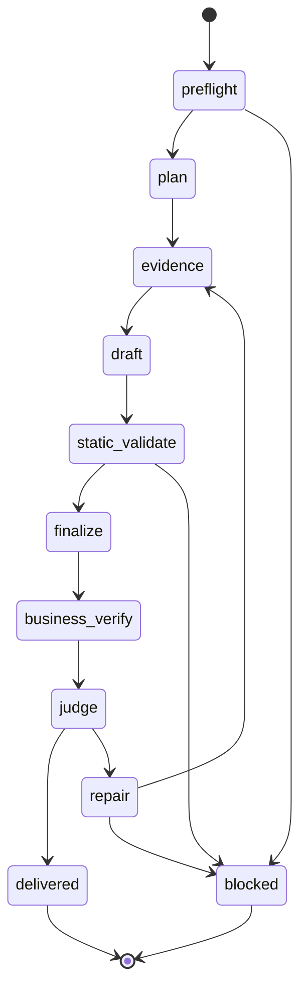

# Finwork Agent / Harness 设计讨论记录

> 文档性质：讨论记录、问题分析和设计探讨
>
> 不是实施 Spec，也不是已经批准的技术方案。文中的“应该”“建议”“需要”表示讨论中的判断，后续仍需结合代码、评测和产品取舍确认。
>
> 记录日期：2026-08-04

## 1. 这次讨论在解决什么问题

Finwork 的目标不是让模型完成一次漂亮的聊天，而是让 Agent 可靠地完成真实财务工作：读取 PDF、Excel、Word，理解任务，制作或修改文件，检查财务口径，最终交付可以复核的 XLSX/DOCX/PDF。

最近的历史财务评测暴露出一个容易混淆的问题：模型、工具、Skill、运行器、评分器都参与了最终结果。如果 Agent 超时、工具不可用、文件没有 finalize、验证器卡住，最后的失败不一定是模型不会做财务分析。

因此这次讨论的中心问题不是“Pi 能不能调用工具”，而是：

> Finwork 是否有一层足够可靠的 Harness，把模型的思考和工具调用组织成一条有阶段、有证据、可停止、可恢复、可评分的任务流程？

## 2. 讨论中的核心结论

### 2.1 加上 Harness 层会不会变好

会，但改善的范围要说清楚。

Harness 不会把一个没有财务知识的模型变成财务专家，也不会凭空修正模型的算术能力。它能改善的是：

- 模型做了很多事却没有产出文件；
- 文件生成了但没有被验证；
- 验证失败后在原地无限修复；
- 超时以后底层调用仍然运行；
- PDF/OCR/Excel 能力不存在时仍然反复探测；
- 多文件任务只交付了其中一个文件；
- 评分器把证据不足、评测器不可用和明确业务矛盾混在一起；
- 评测结果无法回答“到底是模型、工具还是 Harness 出了问题”。

所以比较准确的表述是：

> Harness 提高的是任务完成率、结果可信度、失败可解释性和模型评测的有效性；它不是模型能力本身。

### 2.2 Harness 是什么

可以用一个给初学者的比喻理解：

| 部分 | 类比 | 作用 |
| --- | --- | --- |
| LLM/模型 | 大脑 | 思考、规划、解释和决定下一步行动 |
| Tool | 手 | 读文件、写 Excel、运行 Python、生成 DOCX |
| Skill | 专业手册 | 告诉模型如何处理 PDF、Excel、Word 等任务 |
| Agent Loop | 工作过程 | 模型调用工具，再根据工具结果继续行动 |
| Harness | 项目经理、质检员、记录员和安全员 | 管阶段、管预算、管超时、管重试、管验证和管交付 |
| Evaluator | 审计员 | 判断结果是否真正符合业务要求 |

模型可以提出“我已经完成了”，但 Harness 必须通过文件、校验结果、hash、事件和业务断言来确认它是否真的完成了。

### 2.3 Pi 和 Finwork 的关系

Pi 更像 Agent 的执行引擎或可嵌入 runtime。它负责模型会话、工具调用、事件、压缩和扩展能力。Finwork 需要在 Pi 外面补上财务领域的完成语义。

ReAct（reason/action/observation）可以描述 Pi 内部的工具循环，但 ReAct 本身不等于“财务任务已经完成”。模型会继续调用工具，并不代表文件已经正确交付。

可以把边界画成：

```text
Pi Agent Loop
  → Finwork 工具与权限
  → TaskContract（任务完成条件）
  → verify（确定性验证与 CompletionEvidence）
  → repair（验证失败后的有限修复）
  → finalize（不可变交付）
  → Run settle / 评测证据
```

## 3. 一个完整 Harness 的概念图

下面是讨论中形成的参考结构，不表示当前项目已经全部实现：



它真正需要的是一个有明确边界的阶段流：



每个阶段都需要能回答：输入是什么、输出是什么、成功条件是什么、失败原因是什么、最多做几次、如何恢复、留下了什么证据。

## 4. Claude SDK 是怎么处理这些问题的

这部分讨论是为了避免把“底层 SDK 能力”和“产品 Harness 能力”混为一谈。

### 4.1 Agent SDK 和托管式 Agent

Anthropic 的文档区分了 Agent SDK 和 Managed Agents：SDK 更偏向由应用自己负责进程、执行环境、权限、工具和生命周期；托管式 Agent 则由平台提供一部分会话、事件和基础设施能力。[Anthropic Agent SDK Migration](https://platform.claude.com/docs/en/managed-agents/migration)

这并不意味着 Claude SDK 自动完成了 Finwork 的业务流程。它可以让 Agent 更好地循环调用工具，但它不知道：

- 合并报表内部往来是否抵消；
- Q4 利润是否超过全年利润；
- Excel 是否已经完成公式 lineage；
- 一个 DOCX 生成了但另一个必需的 XLSX 还缺失；
- 当前修复是否已经没有新证据。

这些仍然需要 Finwork 自己定义。

### 4.2 Claude Tool Runner

Claude Tool Runner 负责自动调用工具、维护对话状态，并循环直到模型不再请求工具；同时可以使用 `max_iterations` 限制工具循环。[Claude Tool Runner](https://platform.claude.com/docs/en/agents-and-tools/tool-use/tool-runner)

但是 `max_iterations` 只是循环次数上限，不是业务收敛判断。它不能自动判断“这个文件已经交付”或“本轮修复没有任何新证据”。

### 4.3 Claude Task Budget

Claude 的 task budget 更像给模型看的自我约束提示：告诉模型大约还剩多少预算，让模型自行决定是否收尾。[Claude Task Budgets](https://platform.claude.com/docs/en/build-with-claude/task-budgets)

它不能代替外部 watchdog，也不能保证：

- 底层 SDK 调用真的被 abort；
- 子进程被杀掉；
- session 被 dispose；
- 超时结果被写入 `result.json`；
- 文件是否已经通过验证。

### 4.4 Plan Mode 的位置

Anthropic 的迁移文档将 Plan Mode 视为客户端/产品层的编排问题。一种做法是先开启只规划的会话，再开启执行会话，而不是由 Agent SDK 自动推断所有业务阶段。

这和 Finwork 当前的讨论是一致的：

> Plan 可以由模型提出，但哪些阶段必须完成、哪些文件必须存在、什么时候允许 repair、什么时候必须停止，应该由 Harness 控制。

## 5. Pi / Finwork 当前已经实现了什么

下面是根据当前代码和最近完整评测做的状态盘点。状态不是最终验收结论，而是当前讨论基线。

| 能力 | 状态 | 当前情况 | 讨论中发现的问题 |
| --- | --- | --- | --- |
| Agent 会话循环 | 🟡 部分有 | Pi session、工具调用、`waitForIdle`、事件记录 | 没有统一的财务业务阶段 |
| 请求取消 | 🟡 部分有 | `AbortController`、abort deadline、session dispose | 还需要确认所有子进程和孙进程都被终止 |
| 外层 watchdog | 🟡 部分有 | 每个 Case 有独立 child supervisor | 终止证据和退出原因仍需统一 |
| 超时结果写入 | ✅ 有 | 超时写入 `result.json` | timeout 类型和中断阶段还可细化 |
| 最小文件检查 | ✅ 有 | 检查 XLSX/DOCX/PDF 是否真实存在且可打开 | 还没有完全变成每个交付物的阶段门禁 |
| Finalize 证据 | 🟡 部分有 | 有 `finalize_deliverable`、hash 和 delivery evidence | 同一个文件仍可能被重复 finalize |
| Repair Loop | 🟡 部分有 | 有最大轮次和文件指纹 | 无新证据时仍可能继续消耗模型调用 |
| PDF 文本层优先 | 🟡 部分有 | 已有文本提取优先和 OCR 限制方向 | OCR 依赖缺失时仍可能重复尝试 |
| Excel runtime | 🟡 部分有 | 已接入 artifact-tool provider 和缓存 | 结构化读取还没有完全成为模型默认路径 |
| Excel 业务校验 | 🟡 部分有 | 有基础工作簿验证和重算检查 | 公式 lineage、单位和期间口径还不完整 |
| 财务专用 validator | 🟡 部分有 | 有部分确定性断言和 semantic judge | 覆盖范围和失败等级需要继续细化 |
| 评分器分层 | 🟡 部分有 | deterministic、judge、hard gate 已存在 | `needs_review`、不可用和真正失败要进一步分开 |
| 结果日志 | 🟡 部分有 | JSONL、SQLite、`result.json` 和 supervisor report | 缺少统一的阶段时间线、工具耗时和证据链 |
| Plan 模式 | 🔴 缺少 | 主要依赖 prompt 和模型自行规划 | 没有机器可读的计划和验收条件 |
| 业务阶段状态机 | 🔴 缺少 | 多个局部机制拼接 | 目前最大缺口 |
| Checkpoint 恢复 | 🔴 缺少 | 有 session 文件，但不是业务阶段 checkpoint | 中断后不能从明确阶段恢复 |
| Capability Preflight | 🔴 缺少 | 没有完整能力注册表 | 不知道 OCR、重算引擎、artifact-tool 是否可用 |
| 人工审批点 | 🟡 部分有 | 有确认/授权能力 | 财务高风险动作没有显式审批阶段 |
| Judge 证据输入 | 🟡 部分有 | judge 可以发现业务矛盾 | 需要更多结构化来源和 lineage |

## 6. 最近 7 条评测留下的证据

本轮使用较宽松的模型和 Case 时间预算，目的是先看准确性和 Harness 的真实收敛行为，而不是先追求速度。结果并非模型分数，而是用于定位系统问题的运行证据。

| Case | 实际结果 | 观察到的行为 | 暴露的问题 |
| --- | --- | --- | --- |
| H001 | 超时 | 已生成 Excel，但大量重复 finalize，工具调用 87 次 | 没有收敛判定 |
| H002 | 超时 | 已生成 Excel，但没有 finalize，工具调用 39 次 | 缺少“文件已生成后必须进入交付阶段”的门禁 |
| H003 | 验证失败 | 工作簿长期处于 `validating`，3 轮 repair 后仍未恢复 | 验证器状态和恢复机制有问题 |
| H004 | 超时 | OCR 依赖缺失，仍重复扫描和 OCR 尝试 | 缺少能力预检和明确降级 |
| H005 | 语义失败 | 确定性校验通过，但 judge 发现多个财务矛盾 | judge 对业务矛盾是必要的 |
| H006 | 超时 | 长时间分析，没有生成可交付文件 | 缺少阶段性最小产物和进展判断 |
| H007 | 超时 | DOCX 部分交付，Excel 缺失，重复 finalize 19 次 | 多文件任务没有按交付物分别收敛 |

总体结果是 5 条超时、1 条验证失败、1 条语义失败、0 条完整通过。

这不能简单解释为“模型不行”。更准确的解释是：模型有时能完成局部工作，但 Harness 没有把它稳定地带到“证据 → 文件 → 校验 → 交付”的闭环。

H005 特别说明了这一点：文件和确定性校验都通过了，但语义 judge 仍发现了真实的业务矛盾，例如 Q4 利润与全年利润不一致、前五大客户金额超过 Q1 收入、研发归属矛盾、费用期间解释不一致等。生成文件不等于业务正确。

## 7. 争议点：LibreOffice、artifact-tool 和 Excel 写入

讨论中曾出现“没有 LibreOffice 就写不了 Excel 吗”的疑问。

答案是：**不一定。**

Excel 文件本质上是 OOXML 压缩包。ExcelJS、openpyxl、Python、artifact-tool 等都可以创建或修改 XLSX。LibreOffice 更适合承担部分公式重算、兼容性验证和渲染工作，并不是写入 XLSX 的唯一前置条件。

当前更合理的分层是：

```text
Agent 写入层：ExcelJS / openpyxl / artifact-tool
        ↓
静态结构检查：工作表、范围、公式文本、错误字符串、保护和变化白名单
        ↓
计算/渲染 Provider：artifact-tool 主路径，其他引擎作为能力可用时的 fallback
        ↓
业务断言与语义审查
        ↓
finalize_deliverable
```

这里的重点不是“完全依赖某一个工具”，而是让 Harness 知道当前有哪些工具，给模型明确的能力边界，并且在工具不可用时尽早形成可解释的结果。

artifact-tool 的价值主要在于：

- 可以提供结构化工作簿检查；
- 可以减少模型把整本工作簿倾倒到上下文的需要；
- 可以缓存同一个文件的指纹和检查结果；
- 可以把指定工作表、使用范围、公式摘要和指定单元格作为一等接口。

它不是完整 Excel 兼容性保证，也不能替代财务领域校验器，更不能替代 Harness 的生命周期控制。

## 8. Excel 和 PDF 的输入读取讨论

### 8.1 Excel

模型不应该默认把整本工作簿转成大段文本。更合适的接口是：

```text
list_workbooks()
list_sheets()
get_used_range(sheet)
get_row_labels(sheet)
get_formula_summary(sheet)
get_cells(sheet, ["B12", "F24", "G31"])
get_named_ranges()
get_external_links()
```

这样能降低上下文长度，也更容易追踪公式、单位和具体业务单元格。

### 8.2 PDF

PDF 处理应先尝试文本层，只有必要页面才 OCR：

1. 先读取 PDF 文本层，保留页码、段落顺序和表格边界；
2. 找出文本为空、乱码或关键字段缺失的页面；
3. 只对这些页面或局部区域 OCR；
4. 记录页码、裁剪框、识别引擎、耗时和置信度；
5. OCR 达到限制时，返回“输入提取受限”，而不是无限重试；
6. 在 repair 中复用已经提取的结果，不重复 OCR 整本 PDF。

H004 的 OCR 依赖缺失说明，Skill 里写了处理方法还不够。运行时必须能检测依赖是否存在，并让 Agent 看到结构化的能力状态。

## 9. 评分器讨论

评分器应该分层，而不是只给一个总分：

| 层级 | 判断内容 | 适合的结果 |
| --- | --- | --- |
| Hard Gate | 必需文件、格式、可打开性、不可变交付 | 明确失败就是失败 |
| Deterministic Validator | 数字、公式、平衡、期间、单位、变化白名单 | 可复现错误就是失败 |
| Semantic Judge | 解释完整性、业务矛盾、来源和风险 | 只对明确矛盾阻断 |

以下情况不应直接被判成模型失败：

- 摘录不足；
- 无法完全排除风险；
- 建议补充依据；
- 评测服务不可用；
- 只存在格式或表达改进空间。

这些情况更适合标为 `needs_review`、`insufficient_evidence` 或 `evaluator_unavailable`。

反过来，以下情况应该阻断：

- 核心业务数字相互矛盾；
- 资产负债不平衡；
- 合并报表内部往来未抵消；
- 公式被硬编码替代；
- 关键协议条件被违反；
- 必需交付物缺失。

## 10. 这层设计以后，如何判断真的变好了

不应该只看工具调用数，也不能只看模型最后一句“完成了”。更有意义的观察指标包括：

| 指标 | 要回答的问题 |
| --- | --- |
| 完整交付率 | 必需文件是否全部产生并 finalize |
| 确定性正确率 | 数字、公式、平衡和期间是否正确 |
| 语义阻断率 | judge 发现的明确业务矛盾是否减少 |
| 无效修复率 | 文件和错误都不变时是否仍继续调用 |
| 能力预检命中率 | 工具不可用是否在早期被发现 |
| 超时可解释率 | 每次超时是否都有阶段、最后工具和进度证据 |
| 中断回收率 | abort 后 session、子进程和临时目录是否收干净 |
| 恢复成功率 | 从 checkpoint 继续后是否避免重复全部工作 |
| 模型对比公平性 | 不同模型是否使用同一个合同、校验器和交付门 |

只有这些指标稳定之后，工具调用数减少才有意义。调用少但交付错误，不能算优化。

## 11. 当前比较现实的判断

目前 Finwork 已经有不少 Harness 零件：Agent session、工具、Skill、任务合同、Completion Gate、验证器、repair loop、finalize、watchdog、artifact-tool provider 和历史评测。

但这些零件目前仍然是“局部机制的集合”，还没有完全变成一个统一的运行系统。最明显的缺口是：

1. 没有统一的业务阶段状态机；
2. 没有能力预检注册表；
3. 没有按交付物管理的收敛判定；
4. 没有完整的业务阶段 checkpoint；
5. finalize 和 repair 之间仍可能出现重复循环；
6. PDF、Excel 工具不可用时还需要更清晰的降级路径；
7. 评测报告需要更完整地呈现阶段、证据、工具耗时和阻塞原因。

因此当前更适合的方向不是马上更换模型，也不是马上重写成某个外部 Agent 框架，而是先把现有 Pi 运行时外面的 Finwork 控制层做完整。

## 12. 对话结论的简短版

如果只记住几句话，可以记住：

- Pi 是执行引擎，Finwork Harness 是产品级控制层；
- Agent 会调用工具，不代表任务已经完成；
- Plan 可以由模型提出，但阶段门禁必须由 Harness 控制；
- LibreOffice 不是写 XLSX 的唯一办法，但重算和兼容性仍需要明确 Provider；
- artifact-tool 有价值，但不能替代业务校验和生命周期管理；
- 先解决“准不准、能不能交付、能不能证明”，再优化速度和调用数；
- 先把 Harness 修好，再比较模型，才能知道模型到底行不行；
- 最近 7 条评测的主要信号是 Harness 不收敛、工具能力预检不足、验证和评分分层不够，而不只是模型能力问题。

## 13. 外部参考

- [Anthropic Agent SDK / Managed Agents migration](https://platform.claude.com/docs/en/managed-agents/migration)
- [Claude Tool Runner](https://platform.claude.com/docs/en/agents-and-tools/tool-use/tool-runner)
- [Claude Task Budgets](https://platform.claude.com/docs/en/build-with-claude/task-budgets)
- [Anthropic: Building Effective AI Agents](https://resources.anthropic.com/building-effective-ai-agents)
- [LangGraph overview](https://langchain-ai.github.io/langgraph/)
- [LangGraph interrupts and human-in-the-loop](https://langchain-ai.github.io/langgraph/how-tos/human_in_the_loop/breakpoints/)
