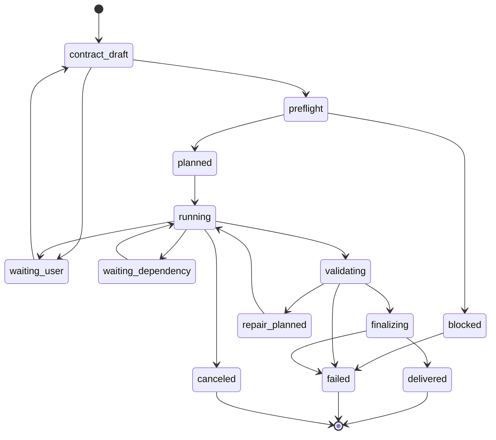

# Finwork Agent 统一能力底座总实施 Spec

> 版本：v1.1  
> 日期：2026-08-12  
> 状态：WP0–WP13 本地实现完成 / 生产切换门待关闭  
> 实施授权：**用户已于 2026-08-11 授权按本文档分步实施并验证**  
> 实施模式：一个工程计划、内部按依赖实施、全部验收后统一切换；禁止长期双轨和静默兜底  
> 研究记录：[`docs/agent-capability-foundation-record.md`](../agent-capability-foundation-record.md)  
> 最终审计：[`docs/spec/audit-agent-capability-foundation.md`](./audit-agent-capability-foundation.md)  
> 兼容基础：既有 Run Contract、AR2a/AR2b、CompletionEvidence、Deliverable Quality Gate

## 0. 使用方式

本文档面向没有对话历史的实施者、审查者和测试者。它是本轮能力底座改造的唯一总 Spec，不再把记忆、RAG、Excel、文档、调研、安全、文件和性能拆成彼此可能漂移的独立方案。

“一次性实施全部”定义为：

1. 所有共享合同在同一工程计划中冻结；
2. 模块可以按依赖并行开发，但不得以不完整能力进入正式产品路径；
3. 迁移期允许离线转换、shadow compare 和双写验证；
4. 运行时不允许把 legacy 逻辑当作新能力失败后的 fallback；
5. 只有全部必选验收门通过后，才一次切换读路径并删除旧写路径；
6. 切换失败只能回滚到切换前完整版本，不能形成半新半旧状态。

本 Spec 批准后，实施者还必须先产出 migration dry-run 和基线报告；它们是实施步骤的一部分，不需要重新发明架构。

### 0.1 实施状态（2026-08-12）

- WP0–WP13 的共享合同、数据库迁移、生产接线、诊断界面和确定性测试已落地。
- 本地 typecheck、完整测试、build、安全矩阵、迁移 dry-run、AS0 合同校验和加速资源 soak 已通过。
- 默认运行权威仍为 `shadow + legacy`；新底座不会在未显式切换时成为写权威，也不会作为失败后的 fallback。
- 生产 Definition of Done 尚未关闭：真实 Provider/Office/网络端到端、真实 24h soak、真实模型 Golden 质量门和预生产原子切换/回滚演练仍是发布阻断项。
- 真实 Files changed、迁移、验证证据、偏差和发布门见最终审计。本文第 3 节复选框仍表示生产级总验收门，不因本地实现完成而自动勾选。

### 0.2 本地实施验收快照（2026-08-12）

- `npm test`、TypeScript、Capability Foundation、安全矩阵、Research、四类预生产协议场景和生产构建均通过。
- `SKIP_LLM=true` Golden 共 51 例，46 例通过，平均分 `0.626`，高于 `0.5` 本地协议门；该结果只证明静态/Mock 合同，不证明真实模型质量。
- AS0 合同校验通过：20 个任务、8 个 fixture、14 个 Skill、53 个生产工具。
- Node 生产运行时启动会同步完整生产工具目录；已删除的财务能力保留为 deprecated 审计记录并标记不可用，目录同步失败会阻断启动，不会继续使用陈旧目录。
- 生产 API 与治理页实测一致展示 53 项可用能力，治理页覆盖案件、证据、记忆、文件生命周期、资源和评测状态，浏览器控制台无 warning/error。
- 当前用户库以只读方式从 `user_version=40` 复制到快照并预演至 `LATEST_VERSION=42`；源数据库及 WAL/SHM 指纹在演练前后保持不变。空库与重复迁移也通过稳定性检查。
- 加速资源 soak 完成 9,612 次迭代、4 次恢复、21 个 checkpoint，无失败；其证据被显式标记为 `mechanism-only-not-release-evidence`。
- `NODE_OPTIONS=--max-old-space-size=4096 npm run build` 已通过并生成 51 个静态页面；编译期动态依赖 warning 仍记录在审计中，不视为真实 Provider/Office 发布门已关闭。
- 无外部凭证环境下的预生产运行按设计返回结构化阻断，未把 fake/跳过结果记为真实能力通过。

## 1. 目标与非目标

### 1.1 目标

建立一个统一、可扩展、可验证的财务 Agent 能力底座，使 Finwork 能够：

- 在执行前准确判断任务所需能力、依赖、权限和资源是否齐备；
- 把复杂业务组织成可恢复、可审计的 Case 和 DAG；
- 让所有工具以统一 Capability Contract 暴露，不依赖 Prompt 猜测；
- 将结论、来源、转换、业务规则和交付物串成 Evidence Ledger；
- 对记忆进行证据化保存、按需使用、冲突管理、过期和清理；
- 对知识库进行结构化、权限感知、快速检索和精确引用；
- 通过 Document IR 与 Workbook IR 支撑高保真文档和复杂 Excel；
- 通过版本化财务规则处理复杂业务，而不是散落 if/Prompt；
- 提供受控联网研究和尽职调查；
- 对数据、Secret、网络、文件和外部内容进行统一安全治理；
- 对文件、索引、预览、缓存和交付进行完整生命周期管理；
- 通过资源预算、增量计算、持久 worker 和 GC 保证长期使用不退化；
- 用确定性验证和黄金案例证明能力，而不是相信模型自述。

### 1.2 非目标

- 不在本 Spec 中替换底层 LLM 厂商；Runtime 只需消费统一能力合同。
- 不把 UI 全面重设计纳入范围，只实现新状态、证据、记忆、文件与 Case 所必需的界面和 API。
- 不承诺首版可以编辑所有 VBA、复杂图表、外部数据连接或受 DRM 保护的文档；遇到不支持结构必须检测、保留或阻断，禁止静默破坏。
- 不内置无授权的商业企业数据库；Provider 未配置时必须明确 `capability_missing`。
- 不把真实用户数据用于训练基础模型。
- 不用“多写 Prompt”替代能力、规则和验证器。

## 2. 不可违反的系统不变量

1. `run_settled.outcome` 保持 `completed | aborted | error`，每个 Run 恰好一次。
2. `waiting_user`、`waiting_dependency`、`paused` 不发 settled。
3. 模型文本、工具调用次数和文件存在都不是完成证据。
4. 正式交付必须有与 artifact hash 绑定的 CompletionEvidence。
5. 每个 Capability 有版本化输入/输出、权限、证据、验证器和失败语义。
6. 缺失能力返回 `capability_missing`；禁止 Bash、Python、模型猜测或低质量解析静默替代。
7. 所有正式 Claim 必须绑定可重放的 Evidence；无 locator 不得正式引用。
8. 所有长期 Memory 必须绑定来源，未经验证的信息不能变为 approved fact。
9. 所有文件和派生物进入 Artifact Graph；仍被引用的对象不得物理删除。
10. 外部文档和网页内容默认 tainted，不得改变系统指令或权限策略。
11. Secret 不进入 Prompt、日志、Memory、普通工具输出或交付物。
12. 资源不足不得通过跳过验证、隐藏错误或截断审计证据解决。
13. 缓存命中必须与输入 hash、工具/规则/权限版本一致。
14. 新旧系统切换后只保留一个权威读写路径。

## 3. 成功标准

### 3.1 功能闭环

- [ ] 任一任务能在执行前生成完整 TaskContract、Capability Preflight 和资源估算。
- [ ] 复杂任务能生成 DAG，跨重启恢复，不重复已幂等完成的步骤。
- [ ] Capability Registry 是工具、Skill、路由、授权和 UI 能力展示的唯一事实源。
- [ ] 每条最终 Claim 可追溯到来源 Artifact、精确 locator、转换和规则版本。
- [ ] 正式交付文件可从 Evidence 反向重放关键验证链。
- [ ] Memory 支持候选、批准、冲突、替代、过期、归档和用户删除请求。
- [ ] RAG 支持 ACL、主体、期间、文档类型过滤和精确引用。
- [ ] DOCX/PDF/PPTX/XLSX 解析产出统一 Document IR locator。
- [ ] Workbook 修改经过 Patch Plan、真实重算、结构验证、业务规则和可逆 diff。
- [ ] 联网研究保存来源快照、覆盖范围、冲突和引用；网页注入不能劫持 Agent。
- [ ] 文件清理 dry-run 能解释每个候选为什么可删，且不会删除被引用对象。

### 3.2 无兜底闭环

- [ ] 解析器、重算器、研究 Provider、Secret 或权限缺失均产生结构化阻断。
- [ ] vector 失败、parser 失败和 index 失败不会静默退回并继续正式交付。
- [ ] 不支持的文档结构不会在另存时静默丢失。
- [ ] validator warning 不能在要求该 validator 的 TaskContract 中被当作通过。

### 3.3 性能闭环

- [ ] 同一 Artifact 不因多次引用而重复解析、嵌入、预览或重算。
- [ ] 100k chunks 使用 ANN 候选检索，不做全表向量扫描。
- [ ] embedding/parser/office worker 使用持久池并有 backpressure。
- [ ] 10k 会话、100k Artifact、1M Evidence/Memory 引用下，列表和检索无全表扫描。
- [ ] 长任务和大文件有 CPU、内存、磁盘、网络、token、时长和输出预算。
- [ ] soak test 后 RSS、临时文件、索引和缓存增长收敛到配置预算内。

### 3.4 安全闭环

- [ ] ACL 在检索、能力执行、文件读取、导出和引用展示时一致执行。
- [ ] Secret Broker 只发放短期最小权限句柄。
- [ ] 网络默认拒绝，按 capability/provider/domain 放行。
- [ ] 文件 quarantine、magic byte、压缩炸弹、宏、外链、公式注入和恶意内容扫描有测试。
- [ ] 审计能还原访问、执行、外发、批准、交付和删除链。

## 4. 目标模块和所有权

### 4.1 新模块

| 目录 | 所有权 | 职责 |
|---|---|---|
| `lib/capability/` | Capability Kernel | 定义、注册、发现、preflight、执行适配、失败语义 |
| `lib/task/` | Task/Case Contract | 合同解析、业务上下文、DAG、checkpoint、人工决策 |
| `lib/evidence/` | Evidence Ledger | Claim、locator、transform、assertion、delivery 证据 |
| `lib/artifacts/` | Artifact Graph | CAS、版本、派生关系、状态、引用、保留和 GC |
| `lib/memory-v2/` | Memory Manager | 五类记忆、候选、批准、冲突、召回、清理 |
| `lib/retrieval/` | Retrieval v2 | ingestion、结构 chunk、ANN、rerank、citation validation |
| `lib/document-ir/` | Document IR | 通用文档节点、locator、adapter、operation、diff |
| `lib/workbook-ir/` | Workbook IR | 结构/公式/财务语义图、Patch Plan、preservation |
| `lib/business-rules/` | Rule Engine | 规则包、适用范围、执行、证据、版本 |
| `lib/research/` | Research Protocol | 查询计划、Provider、快照、来源评级、冲突与 coverage |
| `lib/security/` | Policy/Security | 数据分类、ACL、taint、Secret、egress、DLP、quarantine |
| `lib/resource/` | Resource Governance | worker pool、queue、budget、cache、quota、backpressure |
| `lib/evaluation/` | Evaluation | 合同测试、黄金案例、安全/性能/恢复评测 |

### 4.2 现有模块的迁移关系

| 现有位置 | 迁移后角色 |
|---|---|
| `lib/agent/run-contract.ts` | 保留 AR 兼容类型；TaskContract v3 从 `lib/task/` 导出并适配 |
| `lib/agent/context-policy.ts` | 删除关键词能力路由；只保留非语义 UI/context policy |
| `lib/agent/tools/registry.ts` | 改为 Capability Registry 的兼容视图，切换后删除重复注册 |
| `lib/agent/mcp-tools/*` | 变为 Capability adapter，不自行定义权限、证据或完成语义 |
| `lib/agent/pi/tool-adapter.ts` | 消费 CapabilityDefinition，映射 runtime event |
| `lib/agent/pi/builtin-tools.ts` | 只注册通过 Policy 的基础能力，不作为缺失领域能力的 fallback |
| `lib/agent/system-prompt.ts` | 改为注入任务所需的 Memory/Evidence 引用摘要 |
| `lib/db/role-memory-store.ts` | 迁移到 Memory v2，旧表只读到 cutover 完成 |
| `lib/memory/file-store.ts` | 导入为 procedural/semantic 候选，之后停止写入 |
| `lib/profile/file-store.ts` | 用户显式设置保留；推断事实迁入 Memory v2 |
| `lib/knowledge/*` | 逐步被 `lib/retrieval/` 和 `lib/document-ir/` 接管 |
| `lib/deliverable/*` | 保留质量门；Artifact/Evidence 提供输入与不可变引用 |
| `lib/db/artifact-store.ts` | 迁入 Artifact Graph store，提供 legacy adapter |
| `lib/chat/generated-files.ts` | 只读 Artifact/Delivery 状态，不再维护第二套文件语义 |
| `lib/maintenance/retention.ts` | 改为 Artifact/Memory/Cache policy 调度器 |
| `lib/maintenance/dedup.ts` | 改为 CAS 引用合并，不直接按文件猜测删除 |
| `lib/runtime/cleanup.ts` | 只清无引用 temp；持久对象由 mark-and-sweep 管理 |

### 4.3 数据库所有权

所有新表和索引由 `lib/db/migrations.ts` 分配连续 migration。不得由子模块运行时自行建表。

建议表族：

```text
capability_definitions / capability_instances
task_contracts / cases / case_nodes / case_edges / task_steps / step_attempts
artifacts / artifact_refs / artifact_edges / artifact_leases
evidence_records / claims / claim_evidence / assertions
memory_records / memory_edges / memory_access / memory_candidates
document_nodes / document_locators / workbook_nodes / workbook_edges
knowledge_chunks / chunk_edges / embedding_index_meta / citations
research_sources / research_snapshots / research_claims
policy_decisions / secret_leases / egress_events / security_findings
resource_usage / cache_entries / gc_runs / evaluation_runs
```

Blob、大型 IR、网页快照和工具输出写入 CAS；SQLite 只存元数据、索引、关系和小型结构化值。

## 5. 共享合同

### 5.1 CapabilityDefinition

```ts
interface CapabilityDefinition<I, O> {
  id: string
  version: string
  title: string
  inputSchema: JsonSchema<I>
  outputSchema: JsonSchema<O>
  preconditions: CapabilityPrecondition[]
  sideEffects: SideEffectDeclaration[]
  requiredPermissions: PermissionRequirement[]
  evidenceProduced: EvidenceDeclaration[]
  resourceEstimate: ResourceEstimate
  validator: ValidatorRef[]
  failureSemantics: FailureSemantics
  idempotency: IdempotencyContract
  handler: CapabilityHandler<I, O>
}
```

`failureSemantics` 至少区分：

```text
invalid_input
capability_missing
dependency_unavailable
permission_denied
policy_blocked
resource_exhausted
transient_external_failure
deterministic_validation_failed
human_decision_required
canceled
internal_error
```

只有声明为 transient 且 idempotent 的错误可以自动重试。重试必须记录 attempt、退避和输入 hash。

### 5.2 TaskContractV3

```ts
interface TaskContractV3 {
  id: string
  version: 3
  goal: string
  caseId?: string
  businessContext: {
    entities: EntityRef[]
    counterparties: EntityRef[]
    periods: PeriodRef[]
    effectiveDate?: string
    currencies: CurrencyRef[]
    units: UnitRef[]
    accountingStandards: string[]
    jurisdictions: string[]
  }
  inputs: ArtifactRef[]
  requiredCapabilities: CapabilityRequirement[]
  invariants: AssertionSpec[]
  expectedOutputs: OutputContract[]
  evidenceRequirements: EvidenceRequirement[]
  humanDecisionPoints: HumanDecisionSpec[]
  noGuess: string[]
  noDegrade: string[]
  security: DataHandlingPolicy
  retention: RetentionPolicy
  budget: ResourceBudget
}
```

合同解析允许模型提出草案，但 Runtime 必须使用 schema、已知 Artifact、用户输入和业务规则确定性校验。缺少关键字段时进入 `waiting_user`。

### 5.3 Case Graph

Case 节点类型：Entity、Person、Period、Contract、Invoice、Voucher、Obligation、Assumption、Decision、Risk、Artifact、Claim、Deliverable。

边类型：`belongsTo`、`coversPeriod`、`derivedFrom`、`supports`、`contradicts`、`requiresApproval`、`supersedes`、`deliveredAs`。

Case 是跨 Run 的业务容器；Run 仍是一次执行实例。一个 Case 可以有多个 Run，一个 Run 只能有一个主 Case。

### 5.4 EvidenceRecord 与 Claim

```ts
interface EvidenceRecord {
  id: string
  type: "source" | "extraction" | "transform" | "assertion" | "delivery"
  artifact: ArtifactRef
  locator?: DocumentLocator
  producer: { capabilityId: string; version: string; attemptId: string }
  inputs: EvidenceRef[]
  outputHash: string
  confidence?: number
  uncertainty?: string[]
  policyDecisionId: string
  createdAt: string
}

interface Claim {
  id: string
  caseId: string
  statement: string
  structuredValue?: JsonValue
  evidenceRefs: string[]
  status: "candidate" | "verified" | "contradicted" | "superseded"
}
```

### 5.5 ArtifactRef 与生命周期

```ts
interface ArtifactRef {
  artifactId: string
  versionId: string
  sha256: string
  mediaType: string
  logicalName: string
  state: "staging" | "candidate" | "delivered" | "archived" | "tombstoned"
}
```

CAS 写入顺序：临时写入 → fsync → hash → 原子 rename → metadata transaction。禁止数据库已提交但 blob 不存在。

### 5.6 MemoryRecordV2

```ts
interface MemoryRecordV2 {
  id: string
  kind: "working" | "episodic" | "semantic" | "procedural" | "feedback"
  scope: MemoryScope
  entityRefs: string[]
  effectivePeriod?: PeriodRef
  content: JsonValue
  sourceEvidenceRefs: string[]
  confidence: number
  sensitivity: DataClassification
  approvalStatus: "candidate" | "approved" | "rejected" | "expired"
  supersedes: string[]
  conflictsWith: string[]
  createdAt: string
  lastUsedAt?: string
  expiresAt?: string
  owner: PrincipalRef
}
```

### 5.7 CitationRecord

Citation 必须能直接打开精确位置。支持 page/section/paragraph/table/sheet/range/char offsets；synthetic line number 不能作为正式 locator。

### 5.8 DocumentIR 与 WorkbookIR

IR 节点 ID 必须在同一 Artifact version 内稳定。Adapter 更新后，locator migration 必须能将旧引用映射到新节点或明确标记 stale。

WorkbookIR 附加：公式 AST、依赖边、named range、外链、财务维度、preservation manifest 和 calculation state。

### 5.9 PolicyDecision 与 ResourceBudget

每次 Capability 执行产生 PolicyDecision：principal、case、capability、artifact、data classification、egress、decision、reason、expiry。

ResourceBudget 覆盖 token、wall time、CPU time、memory、disk、network bytes、tool output、concurrency 和 retry。

## 6. 权威执行流程



执行顺序：

1. 解析并确认 TaskContract；
2. Capability Preflight 同时检查依赖、权限、Secret、网络、资源和验证器；
3. Planner 生成 DAG 与预算分配；
4. 执行节点从 Artifact/Value refs 读取输入；
5. 每个 attempt 记录 event、policy、resource 和 evidence；
6. 节点输出先进入 candidate；
7. Assertion 和 validator 失败形成有限 Repair Plan；
8. 相同 input/evidence/hash 且错误未变化时停止修复；
9. 所有 OutputContract 通过后复制/标记 immutable delivered；
10. RunStore 写唯一终态并发 `run_settled`。

## 7. 工作包与实施细节

所有工作包属于同一次实施。编号表示依赖，不表示允许单独上线。

### WP0：基线、fixture 与迁移 dry-run

交付：

- 当前数据库规模、Artifact 数、Memory 数、chunk 数、磁盘和 RSS 基线；
- 真实匿名化 DOCX/PDF/PPTX/XLS/XLSX、扫描件、宏、外链、大文件 fixture；
- 现有 role memory、memory.md、profile、knowledge、deliverable、generated file 的迁移统计；
- `design-xlsx-capabilities.md` 的现状重评矩阵；
- 每个 silent degrade 路径的失败测试。

门槛：无法解释的数据、孤儿文件和 schema 异常必须列出；不得在 migration 中跳过后继续。

### WP1：Capability Kernel 与 Registry

实现：

- 注册、版本、alias、依赖、preflight、execution adapter；
- 从现有 MCP tools、Pi built-ins、Skill 和 provider 生成统一注册；
- API/UI 只消费 registry；
- 删除关键词决定工具是否存在的逻辑；
- ghost capability（如未接线 WebSearch/WebFetch）必须显示 unavailable。

验收：任一已注册能力均有 schema、permission、evidence、resource、validator、failure contract；CI 拒绝不完整注册。

### WP2：Task/Case Contract、Planner DAG 与恢复

实现：

- TaskContract v3 parser/validator；
- Case Graph store；
- deterministic planner shell，模型只提出候选步骤；
- DAG 拓扑检查、幂等 key、checkpoint 和 resume；
- 人工确认节点和超时；
- 继续兼容现有 RunStore/AR2a/AR2b。

验收：进程中断后从最后提交 checkpoint 恢复；已完成幂等节点不重复副作用。

### WP3：Artifact Graph 与 Evidence Ledger

实现：

- CAS、版本、边、引用、lease、状态机；
- Claim/Evidence/assertion/delivery schema；
- 工具输出大对象写 Artifact，event 只写引用；
- CompletionEvidence 从 Ledger 聚合；
- delivered 不可变；
- Evidence 查看与导出 API。

验收：随机选择一个交付结论可以还原到原始文件精确位置和工具/规则版本。

### WP4：Memory v2

实现：

- 五类 Memory；
- candidate extractor、evidence binding、conflict detector、approval policy；
- entity/period/permission/sensitivity/relevance retrieval；
- lastUsed/decay/expiry/supersede；
- 用户查看、纠正、拒绝、删除请求；
- role memory、memory.md、profile 推断和 compaction facts 迁移。

规则：

- profile 中用户显式设置继续作为配置；
- 推断事实进入 candidate；
- procedural memory 只有对应 golden/eval 通过后才能 approved；
- Prompt 只注入选择后的摘要与 evidence refs。

验收：冲突事实不覆盖；过期税率不在新期间召回；跨主体不泄漏；删除请求可证明完成或说明保留原因。

### WP5：Retrieval v2

实现：

- ingestion job 和持久 worker pool；
- structure-aware chunk graph；
- lexical + ANN vector + parent/child expansion + rerank；
- ACL/entity/period/type/effectiveDate 过滤；
- CitationRecord 和 claim binding；
- parser/index/vector 错误显式化；
- hash 增量 reindex 和版本失效。

验收：引用点击精确定位；权限撤销后缓存也不能返回内容；100k chunks 性能达标。

### WP6：Document IR 与格式适配器

实现：

- 通用节点、样式、locator、operation、diff；
- DOCX adapter：段落、表格、样式、批注、修订、脚注、图片；
- PDF adapter：页、文字块、表格、OCR 区域和 bbox；
- PPTX adapter：slide、shape、text、table、notes；
- XLSX adapter 共享基础 document locator；
- round-trip preservation manifest；
- 不支持特征的 detect/preserve/block policy。

验收：黄金文件往返后结构和视觉 diff 在阈值内；批注/修订/宏/外链不被静默丢失。

### WP7：Workbook IR、Patch Engine 与财务规则

实现：

- workbook structural/formula/finance semantic graphs；
- 公式 AST、依赖和重算状态；
- entity/period/account/currency/unit/scenario mapping；
- Patch Plan、precondition、影响分析、diff、rollback；
- LibreOffice/受控计算 Provider 必选 preflight；
- rule engine 与版本化规则包；
- 将 `check_workbook_ties`、`detect_data_issues`、`merge_labeled_tables` 迁为规则/能力，而非孤立工具。

首个完整规则包：

- 三大报表/附注勾稽；
- 多期间一致性；
- 合并范围、抵消、未实现损益、NCI；
- 外币折算；
- 税率/薪酬/凭证基础规则；
- rule source、jurisdiction、effective period 和 tolerance。

验收：真实工作簿修改保留未触及结构；公式真实重算；业务断言与输出 hash 绑定；引擎缺失时正式交付被阻断。

### WP8：复杂业务 Case 能力

实现：

- 主体、期间、合同、发票、凭证、义务、假设、审批和风险节点；
- Deadline/obligation scheduler；
- 多 Run 协作和人工决策；
- Case 变更历史和决策原因；
- 专员角色改为 capability/rule 视图，不再复制状态。

验收：合并报表、申报复核、资金分析、薪税和尽调案例均可跨重启继续并保留证据链。

### WP9：联网研究与尽职调查

实现：

- Provider 接口、query plan、domain/region policy；
- snapshot Artifact（URL、时间、hash、headers、locale）；
- 一手来源优先、来源评级、名称消歧、冲突图；
- coverage 与 unknowns；
- DD 模板：主体/股权/人员/诉讼/处罚/财务/舆情/关联方；
- 每个结论绑定 snapshot locator；
- robots、rate limit、license 和敏感数据策略。

验收：断网或 Provider 未配置明确阻断；任何网页 prompt injection 不能触发工具或泄露本地数据。

### WP10：安全与 Policy Engine

实现：

- principal/tenant/case/artifact ACL；
- data classification 和 taint propagation；
- Secret Broker 与 lease；
- egress default deny；
- quarantine 和文件扫描；
- DLP、外发审批、不可变 audit；
- Capability 级授权替代工具名级散落判断。

验收：越权检索、缓存越权、路径穿越、压缩炸弹、恶意宏、公式注入、网页注入和 Secret 泄漏测试全绿。

### WP11：文件管理、保留与 GC

实现：

- Artifact lifecycle UI/API；
- logical filename、batch、derivative 和 case grouping；
- CAS 去重；
- mark-and-sweep：root mark → edge trace → dry-run → tombstone → grace → physical delete；
- legal hold、pin、delivered、evidence、memory 引用保护；
- preview/index/cache 独立可回收；
- 恢复站和审计。

验收：故障注入下不会留下 DB/blob 半提交；GC 重复运行幂等；随机引用图 property test 不误删。

### WP12：资源、性能和长期稳定性

实现：

- parser/embedding/office worker pool；
- priority queue、backpressure、cancel 和 watchdog；
- per-run/per-case/global budgets；
- content-addressed incremental cache；
- 大输出 Artifact 化和 Prompt lazy retrieval；
- SQLite index/query plan audit、WAL/checkpoint/compaction policy；
- metrics：RSS、CPU、queue、latency、cache、disk、GC、token、retry。

验收：连续 24h soak、反复大文件、取消/恢复和并发任务后资源回到预算水位；无无界 Map、监听器、child process 或临时文件增长。

### WP13：评测、可观测与必要 UI/API

实现：

- Capability contract tests；
- Task/Case golden manifests；
- artifact/evidence verifier；
- memory/RAG/security/performance scorecards；
- 新状态和缺失能力的用户可理解提示；
- Evidence、Memory、Case、Artifact 生命周期的最小管理界面；
- 开发诊断页展示 registry、worker、queue、cache、GC 和 policy。

验收：评分器能区分 model、capability、dependency、validator、policy、resource 和 evaluator 故障。

## 8. 数据迁移与原子切换

### 8.1 迁移原则

- 每一步可重复、可中断、可恢复；
- 每批记录有 source ID、target ID、hash 和结果；
- 不可解析项进入 quarantine migration report，不静默跳过；
- 迁移期间旧系统继续服务，但只允许明确的 legacy 写入；
- 新系统 shadow read/compare 不影响用户结果；
- cutover 前冻结短窗口写入，完成 final delta migration。

### 8.2 迁移顺序

1. 文件和交付物导入 Artifact Graph；
2. knowledge document/chunk 绑定 Artifact version；
3. role memory、memory.md、profile 推断导入 Memory candidates；
4. Run、deliverable、receipt 和 validator 结果导入 Evidence refs；
5. 现有工具注册生成 Capability adapters；
6. shadow 执行新 preflight、retrieval 和 evidence aggregation；
7. 对比报告达到门槛；
8. 停写窗口，final delta；
9. 原子切换 feature epoch；
10. 观察期后删除 legacy 写路径和重复表；
11. legacy 数据只在备份保留期内只读，之后按批准策略清理。

### 8.3 禁止的兼容方式

- 新检索失败后调用旧检索继续正式回答；
- 新 Memory 无结果时全量注入旧 memory.md；
- Capability 缺失时直接暴露 Bash；
- 新 Evidence 不完整时使用旧“模型说完成”逻辑；
- 新 Artifact 找不到时扫描目录猜测文件。

## 9. Files touched

这是总工程允许的所有权范围。具体实施前由 orchestrator 根据本表生成一次性 branch plan；发现超出范围必须更新本 Spec 并重新审查。

### 9.1 新增范围

```text
lib/capability/**
lib/task/**
lib/evidence/**
lib/artifacts/**
lib/memory-v2/**
lib/retrieval/**
lib/document-ir/**
lib/workbook-ir/**
lib/business-rules/**
lib/research/**
lib/security/**
lib/resource/**
lib/evaluation/**
app/api/capabilities/**
app/api/cases/**
app/api/evidence/**
app/api/artifacts/**
app/api/memory-v2/**
app/api/research/**
tests/capability/**
tests/task/**
tests/evidence/**
tests/artifacts/**
tests/memory-v2/**
tests/retrieval/**
tests/document-ir/**
tests/workbook-ir/**
tests/business-rules/**
tests/research/**
tests/security/**
tests/resource/**
tests/fixtures/capability-foundation/**
scripts/capability-foundation-*.mjs
```

### 9.2 允许修改的现有核心文件

```text
lib/agent/run-contract.ts
lib/agent/contracts.ts
lib/agent/context-policy.ts
lib/agent/system-prompt.ts
lib/agent/run-budget.ts
lib/agent/query-stages.ts
lib/agent/completion-gate-settle.ts
lib/agent/run-event-persistence.ts
lib/agent/tools/registry.ts
lib/agent/tools/authorize.ts
lib/agent/tools/path-policy.ts
lib/agent/pi/tool-adapter.ts
lib/agent/pi/builtin-tools.ts
lib/agent/pi/extension.ts
lib/agent/pi/live-sessions.ts
lib/agent/pi/compaction-facts.ts
lib/agent/mcp-tools/**
lib/db/schema.ts
lib/db/migrations.ts
lib/db/sqlite.ts
lib/db/run-store.ts
lib/db/artifact-store.ts
lib/db/role-memory-store.ts
lib/db/audit-store.ts
lib/memory/**
lib/profile/**
lib/knowledge/**
lib/deliverable/**
lib/chat/generated-files.ts
lib/maintenance/retention.ts
lib/maintenance/dedup.ts
lib/runtime/cleanup.ts
lib/runtime/spreadsheet-runtime.ts
lib/runtime/spreadsheet-probe.ts
app/api/agent/**
app/api/knowledge/**
app/api/memory/**
app/knowledge/**
app/config/memory/**
app/chat/**
tests/history-eval/**
tests/as0/**
tests/pi/**
tests/all.test.ts
package.json
```

不允许把 `.codegraph/` 或已退役的 `graphify-out/` 作为本功能的生成产物提交。

## 10. 测试策略

### 10.1 必须新增

- schema/contract：每个共享合同成功、错误和版本兼容；
- registry：重复 ID、缺字段、依赖环、ghost capability；
- planner：DAG、幂等、checkpoint、resume、人工确认、取消；
- evidence：claim lineage、hash 变化、locator stale、矛盾证据；
- artifact：原子写、CAS、引用、lease、GC、恢复；
- memory：候选、冲突、替代、过期、跨主体/权限、删除；
- retrieval：结构 chunk、ANN、rerank、citation、ACL、失效；
- document IR：各格式 round-trip、diff、unsupported feature；
- workbook IR：公式图、Patch Plan、回滚、重算、规则包；
- research：来源快照、冲突、coverage、provider failure；
- security：taint、prompt injection、egress、Secret、DLP、恶意文件；
- resource：队列、公平性、backpressure、预算、取消、worker leak；
- migration：空库、小库、当前快照、坏数据、中断恢复、重复执行；
- golden：真实财务 Case 的输入、Evidence、交付物和业务断言。

### 10.2 验证命令

实施完成后至少执行：

```bash
npm run typecheck
npm run lint
npm test
SKIP_LLM=true npm run eval:golden:ci
npm run eval:as0:validate
npm run eval:as0:typecheck
npm run build
```

新增建议脚本必须加入 `package.json`：

```bash
npm run test:capability-foundation
npm run eval:capability-foundation
npm run eval:security
npm run eval:resource-soak
npm run migration:capability-foundation:dry-run
```

真实 Provider/模型/Office/联网测试必须由显式环境开关运行，CI 无凭证时用协议级 fake，不得用 fake 结果声称真实能力通过。

### 10.3 交付物验证

XLSX/DOCX/PDF/PPTX fixture 必须保存：

- 输入 hash；
- 工具和规则版本；
- 结构 diff；
- 视觉渲染；
- 真实重算/解析结果；
- 业务 assertion；
- 输出 hash；
- CompletionEvidence。

## 11. 性能与容量门槛

具体绝对值由 WP0 在基准机器上冻结，但不能弱于以下相对门槛：

- 相同 Artifact 二次处理 CPU 时间下降至少 80%；
- 检索 p95 随 chunk 从 100k 增至 1M 不呈线性全表增长；
- worker 数受配置上限约束，任务结束后无孤儿进程；
- 24h soak 中稳定状态 RSS 漂移不超过基线的 15%；
- 临时空间和 preview/cache 超预算后自动回收至低水位；
- 取消请求在 2 秒内停止调度新步骤，并在能力声明的 kill timeout 内终止子进程；
- Prompt 中 Memory/RAG 内容受 token budget 控制，原始大对象永不直接注入。

## 12. 安全验收矩阵

| 威胁 | 必须行为 |
|---|---|
| 跨用户/主体文档检索 | ACL 过滤并记录 denied policy decision |
| 网页提示要求读取本地文件 | taint 阻断，不产生本地读取 capability call |
| Prompt/日志包含 API Key | Secret redaction 测试失败，构建阻断 |
| 压缩炸弹/路径穿越 | quarantine，不解压到目标目录 |
| XLSX 公式注入 | 标记并按输出用途 sanitize 或阻断 |
| 宏/外部链接 | preservation manifest + policy 决策；不得静默执行 |
| 未批准外部上传 | egress deny + 用户可理解提示 |
| GC 删除交付证据 | 引用保护，property test 必须失败删除请求 |
| 缓存权限变化 | cache key/authorization recheck，旧结果不可见 |

## 13. 失败与修复语义

- Repair 只能由 validator/assertion 的结构化失败触发；
- 每个失败类型有最大次数和允许修改范围；
- 输入 hash、输出 hash、错误集合三者均未变化时立即停止；
- 资源耗尽先暂停/排队，不自动降低验证级别；
- provider transient failure 可按合同退避重试；
- capability missing、permission denied、policy blocked 不重试；
- human decision required 进入 `waiting_user`；
- 恢复后必须沿用原 TaskContract、policy epoch 和 evidence chain；
- 任何 repair 都生成新 Artifact version，不能原地覆盖正式交付。

## 14. 可观测与审计

每个 Run/Case 至少可查询：

- 合同版本和变更；
- DAG 与节点状态；
- capability、版本、attempt、时长和资源；
- PolicyDecision 和 Secret lease（不含 Secret 值）；
- 输入输出 Artifact refs；
- Evidence/Claim/assertion；
- cache hit/miss 和来源；
- retry/repair 原因；
- waiting/cancel/failure/settle；
- delivery 和 GC/retention 影响。

日志用于运维，Evidence 用于可信度，Audit 用于责任链；三者不能混为一个无限增长文本表。

## 15. 实施组织与集成顺序

### 15.1 合同冻结顺序

1. CapabilityDefinition、FailureSemantics、PolicyDecision；
2. ArtifactRef、EvidenceRecord、Claim；
3. TaskContractV3、Case Graph、DAG state；
4. MemoryRecord、Citation、DocumentIR、WorkbookIR；
5. ResourceBudget、cache key、evaluation manifest。

冻结后下游只能消费，不自行增加兼容字段。需要变更由合同 owner 修改并重跑所有消费者测试。

### 15.2 可并行区域

共享合同冻结后可并行：

- Artifact/Evidence；
- Memory/Retrieval；
- Document IR/Workbook IR；
- Research/Security；
- Resource/Evaluation。

Planner、UI/API 和 migration 只在合同稳定后接入。

### 15.3 集成门

不得按工作包局部发布。最终集成门要求：

- migration dry-run 无未解释丢失；
- shadow compare 达标；
- 全量测试、build、安全、性能、soak 和 golden 通过；
- 无 ghost capability 和 silent degrade；
- legacy 写路径已关闭；
- rollback 在预生产完整演练；
- 审计文档列出所有 commit、migration、测试证据和剩余限制。

## 16. Definition of Done

只有同时满足以下条件才算完成：

1. 本 Spec 中 WP0-WP13 全部实现并通过各自验收。
2. Capability Registry 成为唯一能力事实源。
3. Task/Case、Artifact、Evidence、Memory、Citation 使用新合同。
4. Document/Workbook IR 支撑正式读写与引用。
5. 至少一个复杂合并报表、一个税务/薪酬案例、一个多文档 RAG 案例、一个联网尽调案例端到端通过。
6. 所有正式结论和文件都有可检查 Evidence。
7. 安全矩阵和 24h soak 通过。
8. 现有 AR2a/AR2b、取消、确认、交付和历史评测合同无回归。
9. 新系统原子切换成功，legacy 写路径和重复注册被删除。
10. 产出 `docs/spec/audit-agent-capability-foundation.md`，记录真实 Files changed、偏差、migration、验证和开放风险。

## 17. 风险与处理

### 17.1 范围大

处理：一个总合同、严格 ownership、内部工作包和集成门；不通过拆成互相漂移的小方案降低表面复杂度。

### 17.2 数据迁移不可逆

处理：只增量写新表、CAS 不破坏原件、dry-run、可重复 migration、切换前备份、epoch rollback。

### 17.3 IR 设计过度抽象

处理：由真实 DOCX/PDF/PPTX/XLSX fixtures 驱动最小节点集；没有 fixture 的字段不先泛化，但 unsupported feature 必须显式表示。

### 17.4 性能改善与证据保留冲突

处理：大型内容 Artifact 化、关系与摘要入库、冷热分层；不删除 Evidence，只回收可重建派生缓存。

### 17.5 联网数据法律与授权差异

处理：Provider/region policy、license metadata、来源快照和 coverage；未授权地区明确 capability missing。

### 17.6 模型绕开 Kernel

处理：Runtime 只暴露 Capability adapter；生产环境不直接注册未受控 Bash/网络/文件工具。

## 18. 实施开始前的必做检查

用户明确批准实施后，第一轮只能完成以下内容并报告，不得直接大规模改造：

1. 确认主分支/当前分支与 dirty worktree；
2. 执行 WP0 基线；
3. 读取当前数据库和 fixture 规模；
4. 冻结 migration 号段和模块 owner；
5. 生成共享合同 PR diff；
6. 由 reviewer 审查不变量、失败语义和切换策略；
7. 审查通过后才进入并行实现。

这是实施流程的一部分，不是重新讨论是否做这些能力。
